## Capítulo IV: Product Design

### 4.1. Style Guidelines

Las siguientes pautas de estilo definen los principales criterios visuales utilizados en el diseño de SecurityBus, con el objetivo de mantener una interfaz consistente y facilitar el trabajo conjunto entre diseño y desarrollo. Estas pautas contemplan aspectos como la identidad visual, paleta de colores, tipografía, espaciado, componentes e interacción.

El diseño de SecurityBus está orientado a transmitir seguridad, control y monitoreo, priorizando la claridad de la información y la rapidez de interpretación. Esto responde a la naturaleza de la plataforma, enfocada en la gestión y supervisión del transporte público.

#### 4.1.1. General Style Guidelines

Las decisiones generales de estilo se basan en los atributos que busca transmitir SecurityBus como producto: seguridad, precisión, modernidad y disponibilidad constante. A nivel visual, se toma como referencia el diseño de dashboards y sistemas de monitoreo, donde la información debe presentarse de manera clara y organizada.

**Branding y tono de comunicación**

La identidad visual de SecurityBus busca representar una plataforma tecnológica, confiable y eficiente, orientada a la supervisión y gestión del transporte público.

La aplicación busca transmitir las siguientes características:

+ Segura
+ Precisa
+ Moderna
+ Siempre activa

El tono de comunicación es serio, formal, respetuoso y sereno, debido al contexto de seguridad en el que se utiliza la plataforma. Por ello, se priorizan mensajes directos y claros, evitando expresiones informales o ambiguas.

**Color Palette**

La paleta de colores de SecurityBus utiliza principalmente tonos oscuros, acompañados de un verde neón como color principal de acento y rojo para situaciones críticas. Esta combinación busca reforzar la identidad tecnológica del producto y facilitar la identificación de acciones y alertas dentro de la interfaz.

|Color|Hex|Significado y justificación| Uso en la interfaz|Imagen|
|-----|---|---------------------------|-------------------|------|
|Negro| - |Se utiliza como color base debido a que transmite seriedad, profundidad y tecnología. También permite generar un entorno visual enfocado y con pocas distracciones. |Fondo principal y diferentes áreas de la interfaz. | |
|Verde neón| #C3F400 |Es el color principal de acento. Su alta visibilidad permite destacar elementos importantes y transmite dinamismo e innovación. | Botones principales, indicadores y títulos.||
|Verde secundario| #596D0B|Es el color principal de acento. Su alta visibilidad permite destacar elementos importantes y transmite dinamismo e innovación. | Elementos secundarios y variaciones de componentes.||
|Rojo| - |Se utiliza para representar situaciones de emergencia, peligro o acciones que requieren atención inmediata. | Alertas y elementos críticos.||

**Tipografía**

Para la interfaz se utilizan las familias tipográficas Space Grotesk e Inter, seleccionadas por su legibilidad y adaptación a entornos digitales.

+ Títulos: Space Grotesk Bold, 96 px.
+ Subtítulos: Space Grotesk Bold, entre 48 y 60 px.
+ Párrafos: Inter Light/Bold, entre 12 y 24 px.

Esta combinación permite establecer una jerarquía visual clara entre títulos, subtítulos y contenido informativo.


**Spacing y Layout**

El diseño utiliza un sistema de espaciado consistente para mantener una distribución ordenada de los elementos. Las medidas empleadas para padding y spacing siguen múltiplos de 2 px.

+ Base unit: múltiplos de 2 px para padding y spacing.
+ Grid: márgenes de 24 px para mantener una distribución equilibrada.
+ Breakpoints: se considera un ancho de 1440 px y un alto de 1024 px como referencia para la versión web.

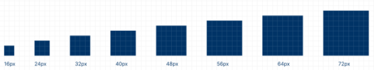

**Componentes visuales**

Los principales componentes de la interfaz siguen criterios visuales consistentes:

+ Botones: verde para acciones principales, rojo para acciones críticas y gris para acciones secundarias.

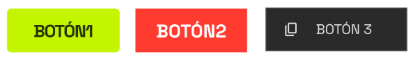
+ Cards: utilizadas para organizar información relacionada dentro de contenedores diferenciados.

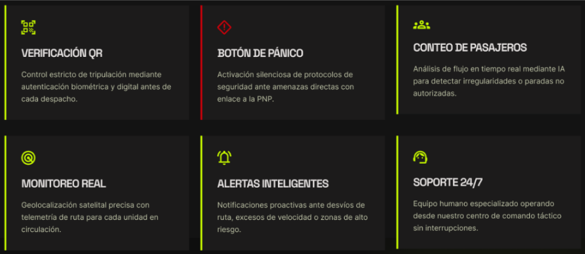
+ Iconografía: se emplea un estilo simple y fácilmente reconocible para facilitar la identificación de acciones y funcionalidades.

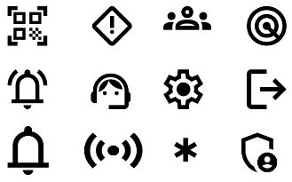

**Principios de diseño**

Las decisiones de diseño de SecurityBus se basan en los siguientes principios:

+ **Claridad**: presentar la información de forma comprensible.
+ **Jerarquía visual**: destacar los elementos de mayor importancia.
+ **Consistencia:** mantener uniformidad en colores, tipografías y componentes.
+ **Accesibilidad**: asegurar una adecuada legibilidad y contraste.
+ **Feedback inmediato**: proporcionar una respuesta visual ante las acciones realizadas por el usuario.

#### 4.1.2. Web Style Guidelines

Las reglas de estilo web de SecurityBus establecen los criterios visuales e interactivos utilizados en la aplicación para mantener una experiencia consistente y funcional.

La interfaz web se organiza de acuerdo con las principales funciones de la plataforma, priorizando la información relacionada con el monitoreo, seguridad y gestión de las unidades de transporte. Los elementos de navegación se mantienen visibles y diferenciados para facilitar el acceso a las diferentes secciones del sistema.

Asimismo, se utilizan componentes como cards, botones, indicadores y elementos de información para organizar los contenidos y evitar una presentación excesivamente cargada. Los elementos más relevantes, como alertas y estados críticos, presentan una diferenciación visual mediante el uso del color rojo.

Los botones y enlaces mantienen una apariencia consistente y proporcionan retroalimentación visual durante la interacción. De esta manera, el usuario puede identificar fácilmente las acciones disponibles y comprender el resultado de sus interacciones con el sistema.

### 4.2. Information Architecture
La arquitectura de información de SecurityBus define cómo se distribuyen, agrupan y presentan los contenidos de la plataforma para facilitar el acceso a las funciones principales. Su diseño considera las necesidades de los dos segmentos identificados: los conductores de transporte público y las empresas o consorcios responsables de supervisar sus unidades.

La estructura busca que cada usuario pueda encontrar la información y las acciones que necesita sin realizar recorridos innecesarios. Para ello, se consideran diferentes mecanismos de organización, etiquetado, búsqueda y navegación que mantienen una relación coherente entre la Landing Page y la aplicación web.

#### 4.2.1. Organization Systems

La organización de la información se establece de acuerdo con el tipo de contenido y con las actividades que realizan los usuarios dentro de SecurityBus.

- **Organización por segmento de usuario:** La plataforma diferencia las necesidades de los conductores y de las empresas o consorcios. El conductor se enfoca principalmente en acciones relacionadas con su seguridad y el reporte de incidentes, mientras que la empresa requiere información para supervisar unidades, conductores y situaciones reportadas.

- **Organización por función:** Las funcionalidades se agrupan según el objetivo que cumplen dentro de la plataforma. Entre ellas se encuentran el monitoreo GPS, las alertas de emergencia, el registro de incidentes, la gestión de conductores y la consulta de información de la operación.

- **Jerarquía de información:** En las vistas de supervisión se prioriza la información relacionada con situaciones de emergencia e incidentes, seguida de los datos operativos de las unidades y conductores. Esto permite que los eventos que requieren mayor atención puedan identificarse rápidamente.

- **Organización cronológica:** La información relacionada con incidentes y recorridos puede presentarse considerando el orden temporal de los registros, lo cual permite consultar acontecimientos recientes y revisar el historial de una unidad.

- **Organización por niveles:** La información parte de una vista general y permite acceder progresivamente a datos más específicos; por ejemplo, desde la supervisión general de unidades se puede llegar al detalle de una unidad o a los incidentes asociados a ella.

#### 4.2.2. Labeling Systems

El sistema de etiquetado utiliza nombres breves y fáciles de identificar para que los usuarios reconozcan rápidamente el propósito de cada sección y acción. Se mantiene principalmente el inglés en los elementos de interfaz, conforme a la implementación de la plataforma.

- **Etiquetas de navegación:**
    - Home: acceso a la página principal.
    - Features: muestra las principales funcionalidades de SecurityBus.
    - Statistics: presenta indicadores y datos relacionados con la supervisión de la operación.
    - Plans: permite consultar los planes de suscripción disponibles para empresas y consorcios.
    - Contact: proporciona un medio de comunicación con el equipo de SecurityBus.
    - Login: permite acceder a la aplicación web.
- **Etiquetas de acción:**
    - Get Started: inicia el proceso para comenzar a utilizar SecurityBus.
    - Choose Plan: permite seleccionar un plan de suscripción.
    - Report Incident: permite registrar o reportar un incidente.
    - View Details: permite consultar información detallada.
    Contact Us: dirige al usuario hacia los medios de contacto.
- **Etiquetas relacionadas con seguridad y operación:**
    - GPS Monitoring: supervisión de la ubicación de las unidades.
    - Panic Button: mecanismo para generar una alerta de emergencia.
    - Incident Log: registro de incidentes reportados.
    - Emergency Alerts: visualización de alertas generadas ante situaciones de emergencia.
    - Route History: consulta del historial de recorridos.

Estas etiquetas buscan mantener una relación directa entre el nombre de cada elemento y la acción o información que representa, reduciendo posibles confusiones durante la navegación.

#### 4.2.3. SEO tags and Meta Tags

Para SecurityBus se consideran etiquetas SEO y metadatos que permiten identificar correctamente la plataforma y describir su propósito, aplicados principalmente en la Landing Page para mejorar su presentación en buscadores, navegadores y plataformas que generan vistas previas de enlaces.

- Título de página, que incorpora el nombre del producto y una descripción breve de su finalidad:

```html
<title> SecurityBus - Public Transport Security </title>
```

- Codificación de caracteres, para representar correctamente el contenido de la plataforma:

```html
<meta charset = "UTF-8">
```

- Configuración responsive, que permite adaptar la visualización a distintos tamaños de pantalla:

```html
<meta name="viewport" content="width=device-width, initial-scale=1.0">
```

- Descripción SEO, que resume la propuesta principal utilizando términos relacionados con seguridad, monitoreo y transporte público:

```html
<meta name="description" content="SecurityBus provides security and monitoring solutions for public transport companies, with GPS monitoring, emergency alerts and incident management.">
```

- Open Graph, que controla la información mostrada al compartir la Landing Page en redes sociales o servicios de mensajería:

```html
<meta property="og:title" content="SecurityBus - Public Transport Security">
<meta property="og:description" content="Improve public transport security with GPS monitoring, emergency alerts and incident management.">
<meta property="og:type" content="website">
```

- Favicon: se utiliza el ícono asociado a la identidad visual de SecurityBus para facilitar el reconocimiento de la página en las pestañas del navegador.

#### 4.2.4. Searching Systems

Los mecanismos de búsqueda están orientados principalmente a facilitar la localización de información operativa dentro de la aplicación web. Dado que la plataforma maneja múltiples unidades, conductores e incidentes, se consideran mecanismos que reduzcan el tiempo necesario para encontrar un registro específico:

- **Búsqueda por unidad:** permite localizar una unidad mediante información identificativa disponible en el sistema.

- **Búsqueda de conductores:** facilita la localización de un conductor registrado mediante su nombre u otra información asociada.

- **Filtrado de incidentes:** permite consultar los incidentes registrados según criterios como tipo, estado o periodo de registro.

- **Consulta de información específica:** una vez localizado un registro, el usuario accede a su información detallada sin recorrer manualmente todas las secciones de la plataforma.

Estos mecanismos facilitan el trabajo de las empresas y responsables de supervisión, especialmente cuando aumenta la cantidad de unidades, conductores o incidentes.

#### 4.2.5. Navigation Systems

SecurityBus organiza su navegación en función del contexto en el que se encuentra el usuario ya sea explorando la Landing Page o trabajando dentro de la aplicación y del tipo de acciones que cada segmento necesita realizar con mayor frecuencia.

- En la Landing Page, un navbar agrupa el acceso a las secciones informativas (Home, Features, Statistics, Plans, Contact) junto con el ingreso a Login, funcionando como punto de entrada general a la plataforma.

- Los CTA (Call to Action) distribuidos en la Landing Page funcionan como atajos hacia acciones puntuales como "empezar a usar el servicio", "revisar los planes disponibles" o "contactar al equipo" sin que el usuario tenga que buscarlas dentro del menú.

- Dentro de la aplicación, la navegación deja de girar en torno a contenido informativo y se reorganiza alrededor de las funciones de gestión y supervisión disponibles para el usuario autenticado.

- A nivel contextual, la interfaz habilita el paso de una vista general a una más específica: por ejemplo, de un listado de unidades se puede llegar al detalle de una unidad puntual, y de ahí a sus recorridos o incidentes asociados.

- A nivel de tareas, la estructura refleja las prioridades de cada segmento: para los conductores, las acciones de seguridad y reporte de incidentes quedan al frente; para las empresas y consorcios, se prioriza el acceso a supervisión, gestión y consulta de información operativa.

### 4.3. Landing Page UI Design

#### 4.3.1. Landing Page Wireframe

- Landing Page

1. Hero

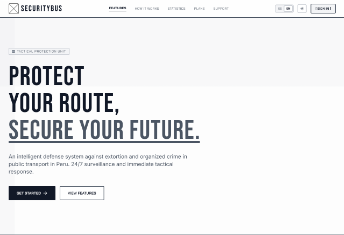

2. Metrics 

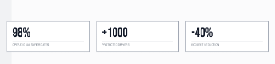

3. Features 

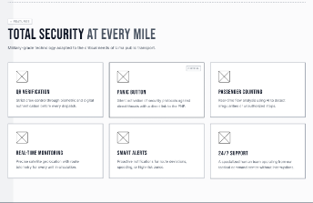

4. How SecurityBus Works 

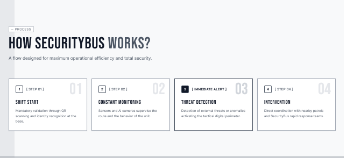

5. Plan for Consortia 

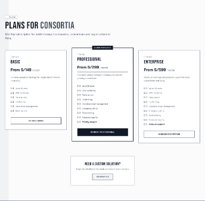

6. SecurityBus Statistics 

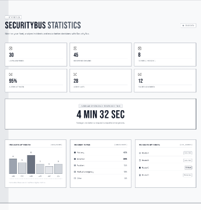

7. Elite Protection CTA 

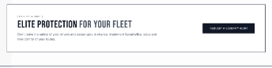

8. About The Team 

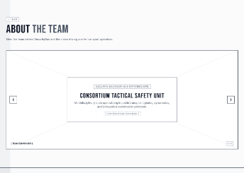

9. Product Gallery 

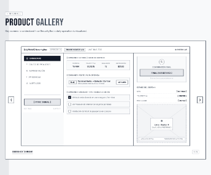

10. Footer 


- Mobile Web Browser


#### 4.3.2. Landing Page Mock-up

- Landing Page

1. Hero

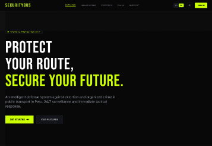

2. Metrics 


3. Features 

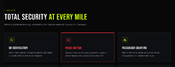

4. How SecurityBus Works 

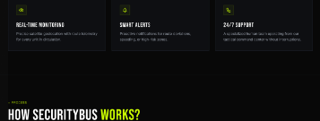

5. Plan for Consortia 

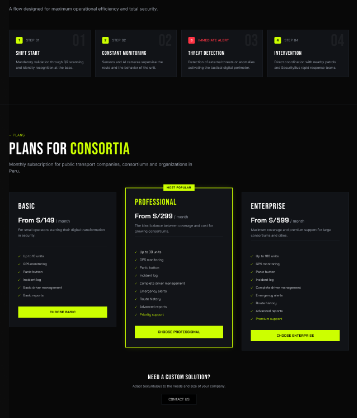

6. SecurityBus Statistics 

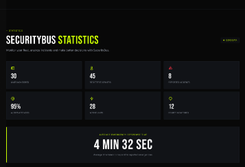

7. Elite Protection CTA 

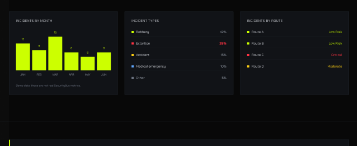

8. About The Team 

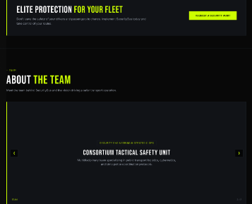

9. Product Gallery 

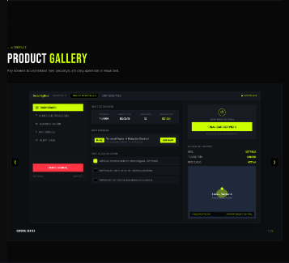

10. Footer 


- Mobile Web Browser


### 4.4. Web Applications UX/UI Design

#### 4.4.1. Web Applications Wireframes

En esta sección se presentan los wireframes elaborados para la plataforma SecurityBus. Estos constituyen una representación estructural de las interfaces y permiten definir la distribución de los elementos, la organización del contenido y la jerarquía de la información antes de incorporar los componentes visuales del diseño final.

El desarrollo de los wireframes contempla las principales interacciones de los usuarios con la plataforma, considerando de manera diferenciada las necesidades y objetivos correspondientes a los perfiles de consorcio o empresas de transporte público y conductores de trasnporte público. De esta manera, se establece una estructura que facilita la navegación y permite validar la organización de las funcionalidades del sistema.


Trabajo elaborado en Figma: [https://www.figma.com/design/dZGVlWuEfGy76GBO9a8nmO/SecurityBus?node-id=130-15&p=f&t=3KHRsRuGU2L8xZIc-0](https://www.figma.com/design/dZGVlWuEfGy76GBO9a8nmO/SecurityBus?node-id=130-15&p=f&t=3KHRsRuGU2L8xZIc-0 'Web Applications Wireframes')

**1. Acceso y autenticación del conductor**


**2. Validación de identidad del conductor**


**3. Confirmación del acceso del conductor**


**4. Panel principal del conductor**


**5. Inicio y configuración del servicio**


**6. Registro y monitoreo del conteo de pasajeros**


**7. Alerta asociada al conteo de pasajeros**


**8. Visualización de la ubicación de la unidad**


**9. Generación de una alerta de emergencia**


**10. Confirmación de ubicación durante la emergencia**


**11. Confirmación del envío de la alerta**


**12. Resumen de la jornada de servicio**


**13. Finalización del turno del conductor**


**14. Supervisión general de las unidades**


**15. Visualización y atención de una alerta**


**16. Gestión de notificaciones e incidentes**


**17. Gestión de conductores registrados**


**18. Asignación de conductores y unidades**


**19. Consulta del historial de turnos**


**20. Visualización de indicadores operativos**


**21. Gestión y reenvío de alertas**


#### 4.4.2. Web Applications Wireflow Diagrams

En esta sección se presenta la propuesta de Wireflows, elaborada a partir de los User Goals y las User Stories definidas para las aplicaciones incluidas en el alcance del proyecto SecurityBus.

**Task Flow 1: Autenticación y acceso del conductor**
Objetivo del usuario: Permitir que el conductor valide su identidad mediante código QR para iniciar su turno de forma segura y trazable.

Pasos del Task Flow:

1. Acceder a la pantalla de Acceso Conductor y escanear el código QR o ingresar el código de empleado.
2. El sistema valida las credenciales contra el registro central.
3. Confirmar la identidad y visualizar los datos del conductor y del vehículo asignado.
4. Iniciar turno desde la confirmación de acceso.

User Goal 1: Como conductor, quiero validar mi identidad antes de iniciar el servicio, para asegurar la trazabilidad del viaje.

User Persona: Conductor
El conductor accede a la pantalla de Acceso Conductor, escanea su credencial digital o ingresa su código de empleado y presiona "Verificar credenciales". El sistema muestra la pantalla de Validación de Identidad con el escaneo del QR; una vez validado, se presenta la tarjeta de confirmación con nombre, placa del vehículo y estado "Activo", habilitando el botón "Iniciar Turno".

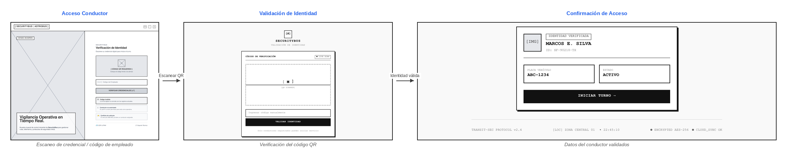

Secuencia: Acceso Conductor → Validación de Identidad → Confirmación del acceso

**Task Flow 2: Inicio de servicio y monitoreo de pasajeros**
Objetivo del usuario: Permitir al conductor iniciar el servicio, monitorear su ruta y controlar el conteo de pasajeros en tiempo real.

Pasos del Task Flow:

1. Configurar el servicio: seleccionar vehículo y turno de trabajo.
2. Iniciar el servicio y acceder al panel principal.
3. Registrar el abordaje y bajada de pasajeros.
4. Recibir alerta si se excede la capacidad máxima.
5. Consultar la ubicación de la unidad en el mapa.

User Goal 2: Como conductor, deseo registrar el inicio del servicio, para dejar evidencia del recorrido.

User Persona: Conductor
Desde Inicio de Servicio, el conductor selecciona el vehículo y el turno (mañana/tarde/noche) y confirma "Iniciar Servicio". El sistema lo redirige al Panel principal (Inicio), donde ve distancia, tiempo, pasajeros y la ruta operada en tiempo real.

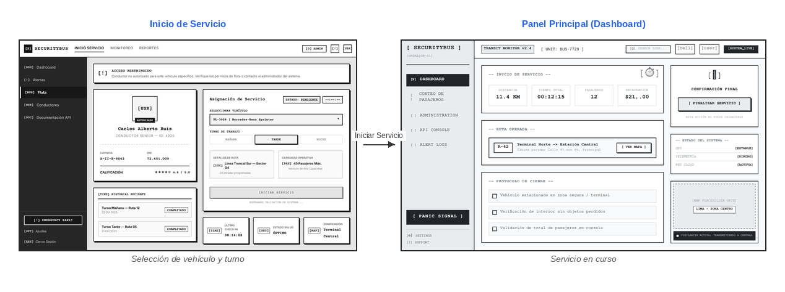

User Goal 3: Como sistema, deseo contabilizar los pasajeros a bordo y alertar cuando se supera la capacidad del vehículo, para evitar altercados y estimar el riesgo.

User Persona: Conductor
Desde el panel de Conteo de Pasajeros, el conductor registra abordajes (+) y bajadas (−). Si el conteo (62/60) supera la capacidad máxima, el sistema dispara el modal "Has alcanzado el límite de pasajeros", que el conductor reconoce con "OK". Desde el mismo panel puede acceder a Ver Mapa para visualizar la ubicación de la unidad y su ruta.

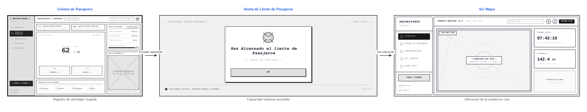

Secuencia: Inicio de Servicio → Panel principal (Inicio) → Conteo de Pasajeros → Alerta de límite de pasajeros → Ver Mapa

**Task Flow 3: Gestión de una alerta de emergencia**
Objetivo del usuario: Permitir al conductor iniciar el servicio, monitorear su ruta y controlar el conteo de pasajeros en tiempo real.

Objetivo del usuario: Permitir al conductor activar una alerta de pánico y a la central confirmar su recepción y ubicación.
Pasos del Task Flow:

1. Activar el botón de pánico (Panic Signal) ante una situación de riesgo.
2. Confirmar el envío de la alerta.
3. La central recibe la ubicación de la unidad en el mapa de operaciones.
4. La central confirma la recepción de la alerta.

User Goal 4: Como conductor, deseo enviar una alerta de emergencia, para notificar una situación de riesgo; como sistema, deseo notificar a la central de operaciones, para gestionar la emergencia.
User Persona: Conductor / Central de Operaciones
Al presionar "Panic Signal", el conductor ve el modal "¡Alerta enviada!" con coordenadas GPS, estado de notificación a central y audio remoto activo, pudiendo cancelar en 5 segundos. La central, en su mapa de operaciones, recibe el pin "SOS" con el popup "Alerta crítica – Unidad" y accede a "Ver detalles". Finalmente, el sistema de central confirma la alerta mediante los pasos "Alert Sent → Alert Received → Confirmed".

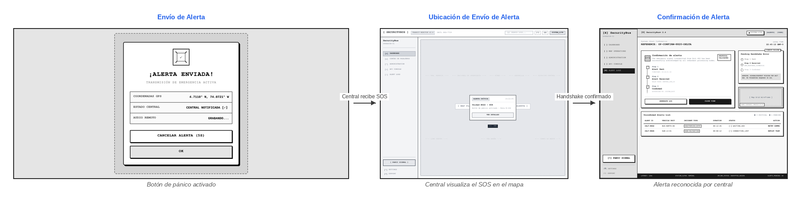

Secuencia: Envío de Alerta → Ubicación de Envío de Alerta (vista central) → Confirmación de Alerta (central)

**Task Flow 4: Cierre de turno del conductor**
Objetivo del usuario: Permitir al conductor finalizar su turno dejando evidencia del servicio realizado.

Pasos del Task Flow:

1. Consultar el resumen del turno (distancia, tiempo, pasajeros, recaudación).
2. Completar el protocolo de cierre (checklist).
3. Confirmar la finalización del servicio.
Visualizar la confirmación de cierre exitoso.

User Goal 5: Como conductor, quiero finalizar mi turno de forma segura y con evidencia registrada, para garantizar la trazabilidad del servicio.
User Persona: Conductor
Al terminar la ruta, el panel muestra el Resumen de Servicio con los totales del turno y el checklist de protocolo de cierre. Al presionar "Finalizar Servicio" (acción irreversible), el sistema muestra el modal "Servicio finalizado correctamente", con opciones "Ver reporte" o "Salir".

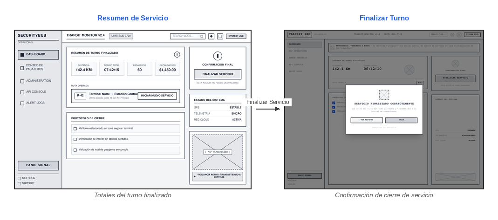

Secuencia: Resumen de Servicio → Finalizar Turno (confirmación)

**Task Flow 5: Supervisión y atención de alertas (Administrador)**
Objetivo del usuario: Permitir a la central supervisar las unidades activas y atender alertas críticas en tiempo real.

Pasos del Task Flow:

1. Visualizar el mapa con las unidades activas.
2. Detectar una alerta activa sobre el mapa.
3. Gestionar notificaciones y destinatarios de la red de alertas.

User Goal 6: Como empresa, deseo conocer el estado de mis vehículos en operación y clasificar las alertas según su gravedad, para tener control operativo.
User Persona: Administrador / Central de Operaciones
Desde el Centro de Control, el administrador visualiza las unidades activas sobre el mapa de Lima. Cuando ocurre una emergencia, el mismo mapa resalta "Alerts: 1 Active". Desde Notificaciones, el administrador gestiona los destinatarios activos y simula el envío de alertas según prioridad (baja/media/urgente).

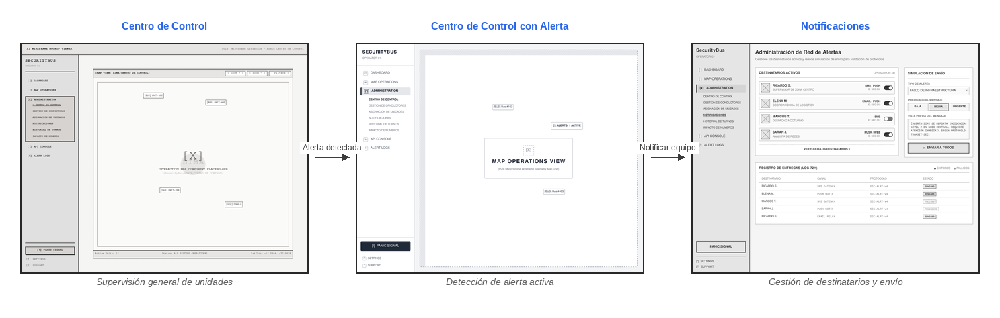

Secuencia: Centro de Control → Centro de Control con Alerta → Notificaciones

**Task Flow 6: Gestión de conductores y unidades**
Objetivo del usuario: Permitir administrar el registro de conductores y su asociación con los vehículos disponibles.

Pasos del Task Flow:

1. Consultar el listado de conductores registrados.
2. Revisar el detalle, licencias y línea de autorizaciones de un conductor.
3. Asociar un conductor disponible a un vehículo disponible.
4. Confirmar la asignación.

User Goal 7: Como sistema, deseo asociar un conductor a un vehículo, para asegurar la trazabilidad.
User Persona: Administrador
Desde Gestión de Conductores, el administrador revisa el listado y accede al detalle de un conductor (licencia, puntos, calificación, historial de autorizaciones). Desde Asignación de Unidades, selecciona un conductor disponible y un vehículo disponible, y confirma con "Confirmar Asignación", quedando reflejado en la tabla de asignaciones vigentes.

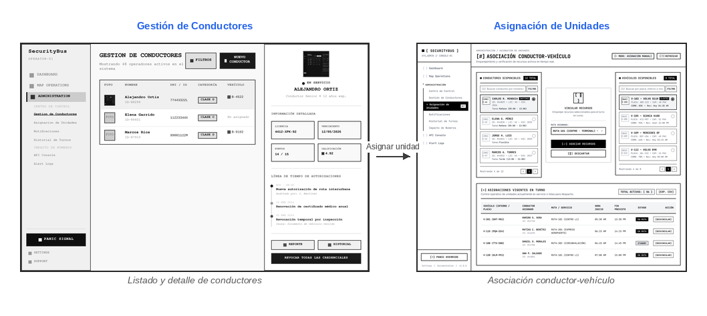

Secuencia: Gestión de Conductores → Asignación de Unidades

Task Flow 7: Trazabilidad y reportes operativos (Administrador)
Objetivo del usuario: Permitir a la central consultar el historial de turnos, indicadores de impacto y gestionar el reenvío de alertas no confirmadas.

Pasos del Task Flow:

1. Filtrar y consultar el historial de turnos por ruta y fecha.
2. Visualizar los indicadores de impacto del sistema.
3. Revisar y reenviar alertas no confirmadas.

**User Goal 8**: Como empresa, deseo conocer la cantidad de personas en distintas unidades, para comparar la ocupación entre distintas rutas.
User Persona: Administrador
Desde Historial de Turnos, el administrador filtra por rango de fecha y ruta, revisando el log de operaciones, pasajeros transportados e incidentes de cada turno. Desde Impacto en Números consulta métricas globales (conductores verificados, alertas gestionadas, pasajeros protegidos). Desde Gestión de Reenvíos, monitorea alertas pendientes/críticas y reenvía las que no fueron confirmadas.

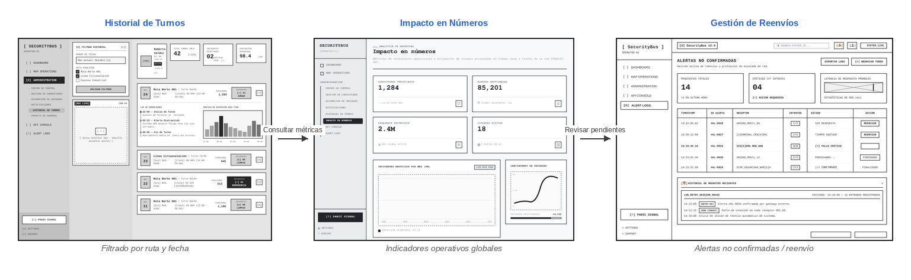

Secuencia: Historial de Turnos → Impacto en Números → Gestión de Reenvíos

#### 4.4.3. Web Applications Mock-ups

En esta sección se presentan los mockups desarrollados para la plataforma SecurityBus, los cuales permiten visualizar la propuesta de diseño de las interfaces con un mayor nivel de detalle. Estos incorporan elementos visuales como colores, tipografías, iconografía, componentes y distribución gráfica, con el propósito de representar de manera cercana la apariencia final de la plataforma.

Los mockups fueron elaborados considerando los principales perfiles de usuario de SecurityBus: los consorcios o empresas de transporte público y los conductores de transporte público. De esta manera, se busca que cada interfaz responda a las necesidades y funcionalidades correspondientes a cada perfil, al mantener una experiencia visual coherente y que facilite la interacción con el sistema.

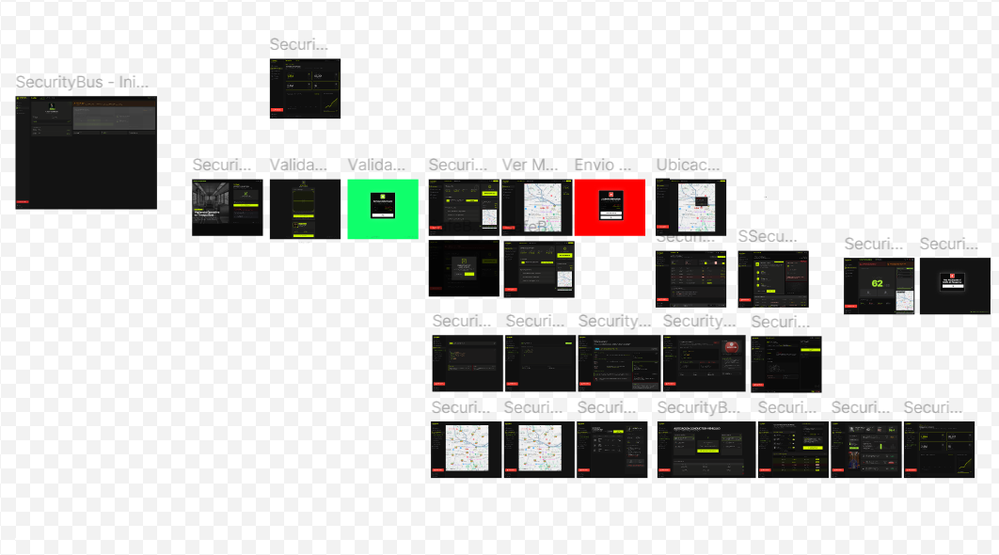

Trabajo elaborado en Figma: [https://www.figma.com/design/dZGVlWuEfGy76GBO9a8nmO/SecurityBus?node-id=0-1&p=f&t=rfW5UFtjZ6xjUzo9-0](https://www.figma.com/design/dZGVlWuEfGy76GBO9a8nmO/SecurityBus?node-id=0-1&p=f&t=rfW5UFtjZ6xjUzo9-0 'Web Application Mockups')

**1. Acceso y autenticación del conductor**


**2. Validación de identidad del conductor**


**3. Confirmación del acceso del conductor**


**4. Panel principal del conductor**


**5. Inicio y configuración del servicio**


**6. Registro y monitoreo del conteo de pasajeros**


**7. Alerta asociada al conteo de pasajeros**


**8. Visualización de la ubicación de la unidad**


**9. Generación de una alerta de emergencia**


**10. Confirmación de ubicación durante la emergencia**


**11. Confirmación del envío de la alerta**


**12. Resumen de la jornada de servicio**


**13. Finalización del turno del conductor**


**14. Supervisión general de las unidades**


**15. Visualización y atención de una alerta**


**16. Gestión de notificaciones e incidentes**


**17. Gestión de conductores registrados**


**18. Asignación de conductores y unidades**


**19. Consulta del historial de turnos**


**20. Visualización de indicadores operativos**


**21. Gestión y reenvío de alertas**


#### 4.4.4. Web Applications User Flow Diagrams

**User Flow 1: Autenticación e inicio de servicio del conductor**

Relacionado al User Goal 1: Como conductor, quiero validar mi identidad mediante código QR antes de iniciar mi turno, para asegurar la trazabilidad del servicio.
El conductor accede a la pantalla de Acceso Conductor, escanea su credencial digital o ingresa su código de empleado. El sistema muestra la pantalla de Validación de Identidad con el escaneo del QR; una vez validado, se presenta la confirmación de acceso autorizado con la transmisión activa hacia central, habilitando el turno.

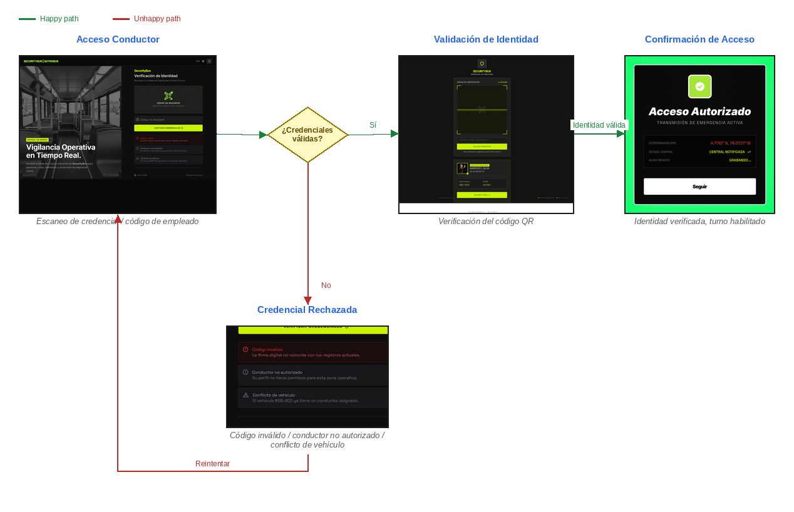

Relacionado al User Goal 2: Como conductor, quiero configurar e iniciar mi servicio, para dejar registro del recorrido que voy a realizar.
Desde Inicio de Servicio, el conductor selecciona el vehículo y el turno de trabajo y confirma "Iniciar Servicio". El sistema lo redirige al Panel Principal (Dashboard), donde visualiza distancia, tiempo, pasajeros y la ruta operada en tiempo real.

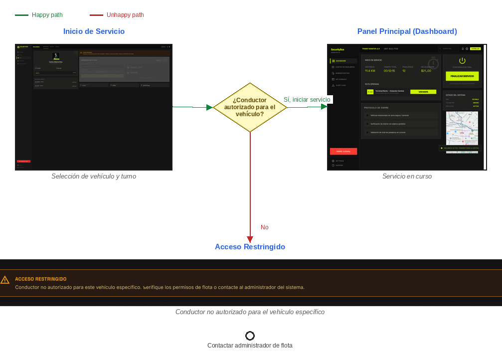

**User Flow 2: Monitoreo de pasajeros y atención de emergencias**

Relacionado al User Goal 3: Como sistema, deseo contabilizar los pasajeros a bordo y alertar cuando se supera la capacidad del vehículo, para evitar altercados y estimar el riesgo.
Desde el panel de Conteo de Pasajeros, el conductor registra abordajes y bajadas. Si el conteo supera la capacidad máxima, el sistema dispara la alerta "Has alcanzado el límite de pasajeros". Desde el mismo panel puede acceder a Ver Mapa para visualizar la ubicación de la unidad en ruta.

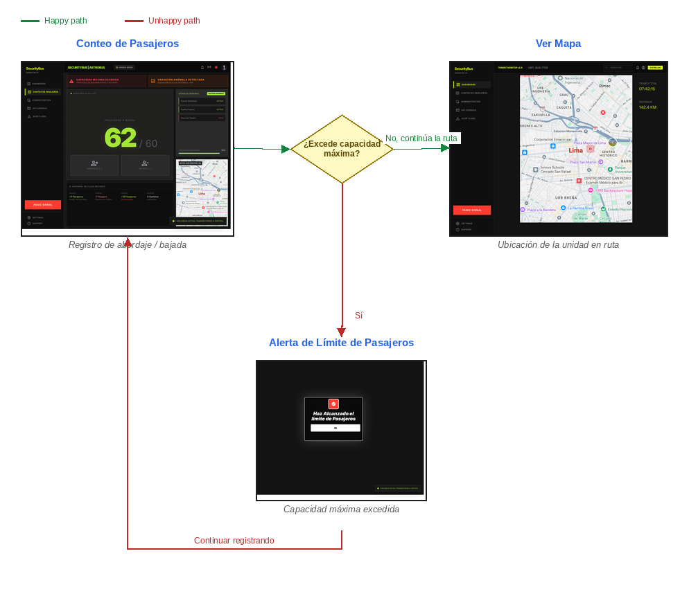

Relacionado al User Goal 4: Como conductor, deseo enviar una alerta de emergencia, para notificar una situación de riesgo; como sistema, deseo notificar a la central de operaciones, para gestionar la emergencia.
Al presionar el botón de pánico, el conductor ve la confirmación "¡Alerta enviada!" con coordenadas GPS y estado de notificación a central. La central, en su mapa de operaciones, recibe el pin "SOS" con los detalles de la unidad y confirma la alerta mediante el protocolo "Alert Sent → Alert Received → Confirmed".

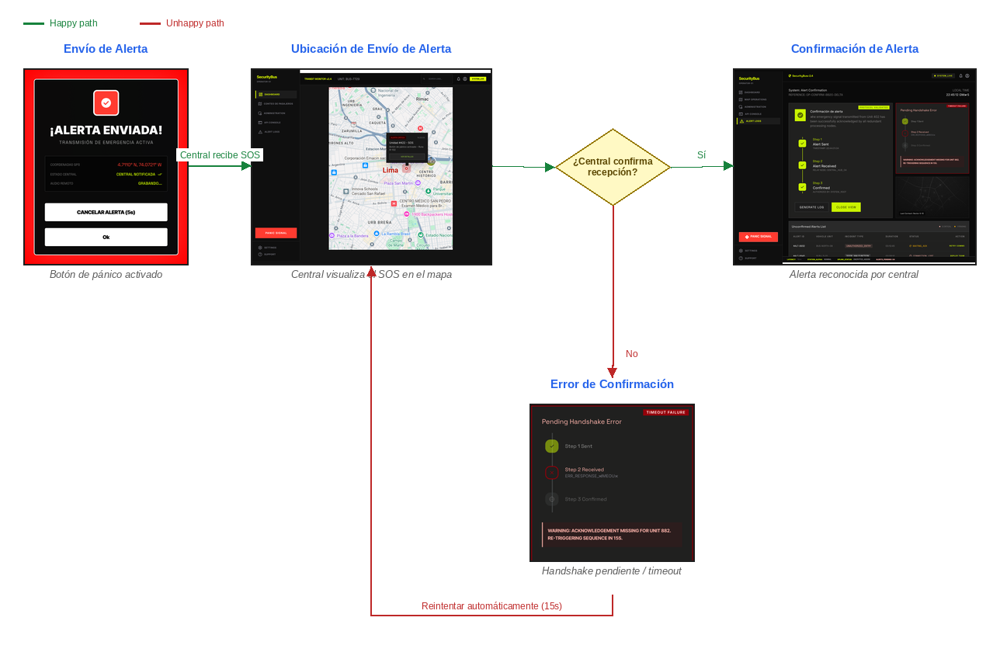

**User Flow 3: Cierre de turno del conductor**

Relacionado al User Goal 5: Como conductor, quiero finalizar mi turno de forma segura y con evidencia registrada, para garantizar la trazabilidad del servicio.
Al terminar la ruta, el panel muestra el Resumen de Servicio con los totales del turno y el checklist de protocolo de cierre. Al presionar "Finalizar Servicio", el sistema muestra la confirmación "Servicio finalizado correctamente".

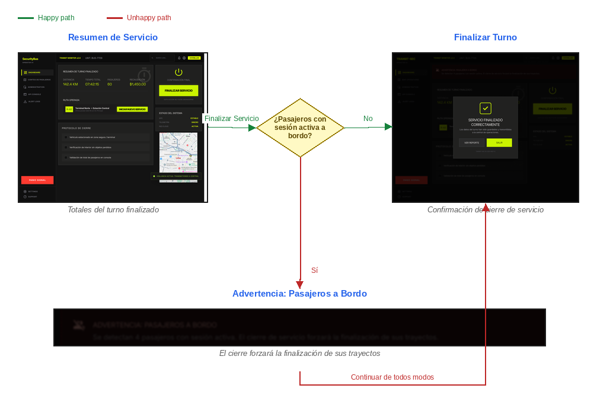

**User Flow 4: Supervisión y atención de alertas (Administrador)**

Relacionado al User Goal 6: Como empresa, deseo conocer el estado de mis vehículos en operación y clasificar las alertas según su gravedad, para tener control operativo.
Desde el Centro de Control, el administrador visualiza las unidades activas sobre el mapa de Lima. Cuando ocurre una emergencia, el mapa resalta la unidad en alerta. Desde Notificaciones, gestiona los destinatarios activos y simula el envío de alertas según prioridad.

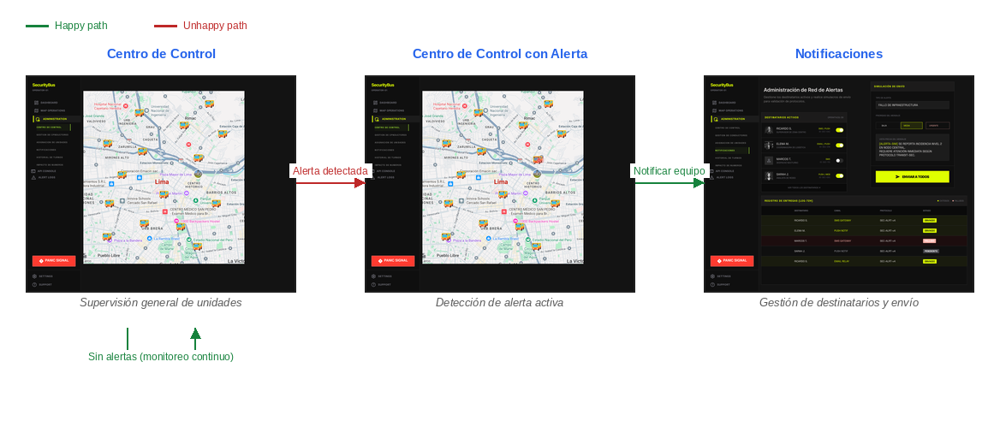

**User Flow 5: Gestión de conductores y unidades (Administrador)**

Relacionado al User Goal 7: Como sistema, deseo asociar un conductor a un vehículo, para asegurar la trazabilidad.
Desde Gestión de Conductores, el administrador revisa el listado y el detalle de cada conductor. Desde Asignación de Unidades, selecciona un conductor y un vehículo disponibles y confirma la asociación, reflejada en la tabla de asignaciones vigentes.

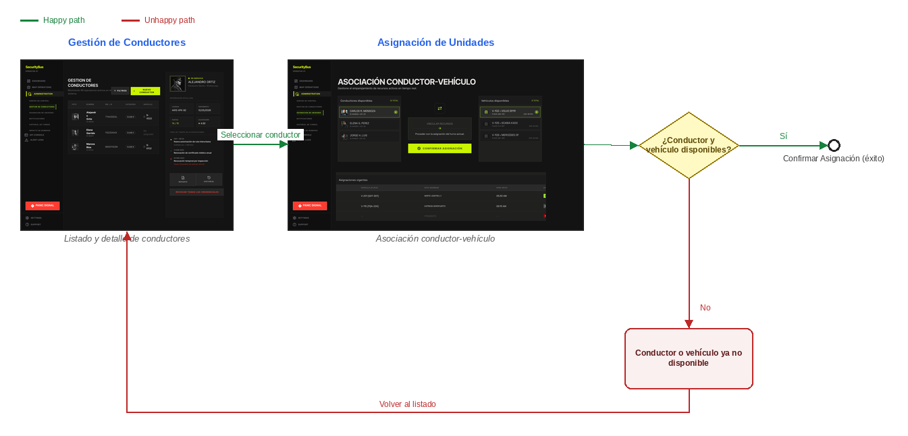

**User Flow 6: Trazabilidad y reportes operativos (Administrador)**

Relacionado al User Goal 8: Como empresa, deseo conocer indicadores globales y el historial de turnos, para comparar la ocupación y el desempeño entre distintas rutas.
Desde Historial de Turnos, el administrador filtra por fecha y ruta, revisando pasajeros e incidentes de cada turno. Desde Impacto en Números consulta métricas globales de la red. Desde Gestión de Reenvíos, monitorea y reenvía alertas no confirmadas.

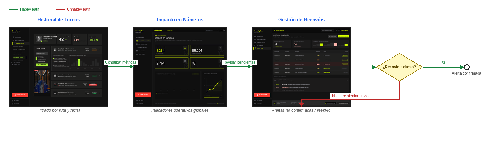

### 4.5. Web Applications Prototyping

En esta sección se presenta el prototipo interactivo de SecurityBus, desarrollado para entornos desktop y mobile, que permite simular la navegación y las principales interacciones de la aplicación. El prototipo busca representar los flujos definidos en los User Flow Diagrams y su relación con la arquitectura de información y el sistema de navegación propuesto.

Para su diseño se consideraron criterios como la claridad de navegación, la consistencia de los componentes y la retroalimentación ante las acciones realizadas. Asimismo, se contemplan las experiencias de los conductores y del personal encargado de la gestión y monitoreo del servicio de transporte.

Finalmente, el video muestra los principales flujos de interacción del prototipo, evidenciando la navegación y ejecución de las tareas principales de SecurityBus.

**<center>Web Applications Prototyping</center>**

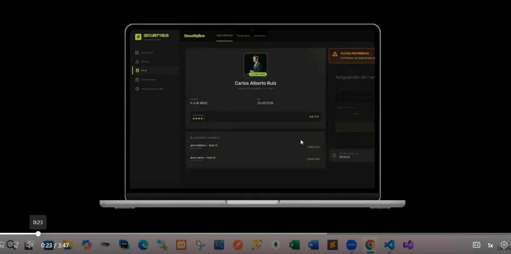

URL del video: [https://upcedupe-my.sharepoint.com/personal/u202418823_upc_edu_pe/_layouts/15/stream.aspx?id=%2Fpersonal%2Fu202418823%5Fupc%5Fedu%5Fpe%2FDocuments%2FSecurity%20Bus%2FDesktop%20Prototyping%2Emp4&referrer=StreamWebApp%2EWeb&referrerScenario=AddressBarCopied%2Eview%2E3b7ed5d3%2D4cf6%2D4834%2D9541%2D63af6480793c&isDarkMode=true](https://upcedupe-my.sharepoint.com/personal/u202418823_upc_edu_pe/_layouts/15/stream.aspx?id=%2Fpersonal%2Fu202418823%5Fupc%5Fedu%5Fpe%2FDocuments%2FSecurity%20Bus%2FDesktop%20Prototyping%2Emp4&referrer=StreamWebApp%2EWeb&referrerScenario=AddressBarCopied%2Eview%2E3b7ed5d3%2D4cf6%2D4834%2D9541%2D63af6480793c&isDarkMode=true)

**<center>Mobile Applications Prototyping</center>**

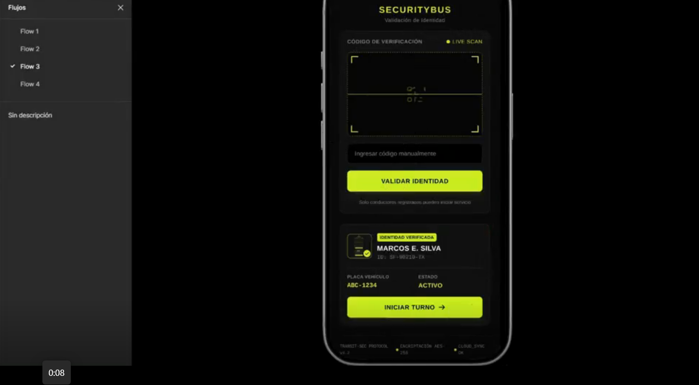

URL del video: [https://upcedupe-my.sharepoint.com/personal/u202418823_upc_edu_pe/_layouts/15/stream.aspx?id=%2Fpersonal%2Fu202418823%5Fupc%5Fedu%5Fpe%2FDocuments%2FSecurity%20Bus%2FMobile%20Prototyping%2Emp4&referrer=StreamWebApp%2EWeb&referrerScenario=AddressBarCopied%2Eview%2E0563ee92%2Dc5c9%2D4938%2Db01c%2D272aff8321f0](https://upcedupe-my.sharepoint.com/personal/u202418823_upc_edu_pe/_layouts/15/stream.aspx?id=%2Fpersonal%2Fu202418823%5Fupc%5Fedu%5Fpe%2FDocuments%2FSecurity%20Bus%2FMobile%20Prototyping%2Emp4&referrer=StreamWebApp%2EWeb&referrerScenario=AddressBarCopied%2Eview%2E0563ee92%2Dc5c9%2D4938%2Db01c%2D272aff8321f0)

### 4.6. Domain-Driven Software Architecture

La arquitectura de software de **SecurityBus** se diseñó aplicando los principios de Domain-Driven Design (DDD). A partir de las cinco épicas definidas en la sección 3.1 se identificaron los *bounded contexts* del sistema y se clasificaron según su valor estratégico para el negocio:

| Bounded Context                             | Clasificación DDD    | Épica relacionada | Responsabilidad                                                                                          |
| :------------------------------------------- | :-------------------- | :----------------- | :--------------------------------------------------------------------------------------------------------- |
| Gestión de Alertas de Emergencia             | **Núcleo (Core)**     | EPNN02              | Emisión, clasificación, difusión, reintento, escalamiento y registro de cada alerta. Es la razón de ser de la plataforma. |
| Gestión de Conductores y Servicios           | Apoyo (Supporting)    | EPNN01              | Identificación del conductor, habilitación, vínculo con la unidad y ciclo de vida del servicio.            |
| Monitoreo de Pasajeros y Ocupación           | Apoyo (Supporting)    | EPNN03              | Conteo de ocupantes, detección de sobrecapacidad y análisis de variaciones.                                |
| Landing Page informativa                     | Genérico              | EPNN04              | Contenido público orientado a visitantes.                                                                  |
| Web Services / API                           | Genérico (habilitador)| EPNN05              | Punto de entrada técnico que expone y protege los recursos del sistema.                                    |

Esta clasificación guía las decisiones de las siguientes tres secciones: el EventStorming de diseño profundiza en los tres contextos con lógica de negocio propia, mientras que los diagramas C4 sitúan a la plataforma completa dentro de su ecosistema técnico.

#### 4.6.1. Design-Level EventStorming

El EventStorming de nivel de diseño toma los *hotspots* identificados en el Big Picture EventStorming (sección 2.4) y los refina en comandos, agregados, eventos de dominio, políticas y modelos de lectura, siguiendo la notación de colores estándar. La Figura 4.1 muestra este refinamiento para los tres *bounded contexts* con lógica de negocio propia:

<p align="center">
  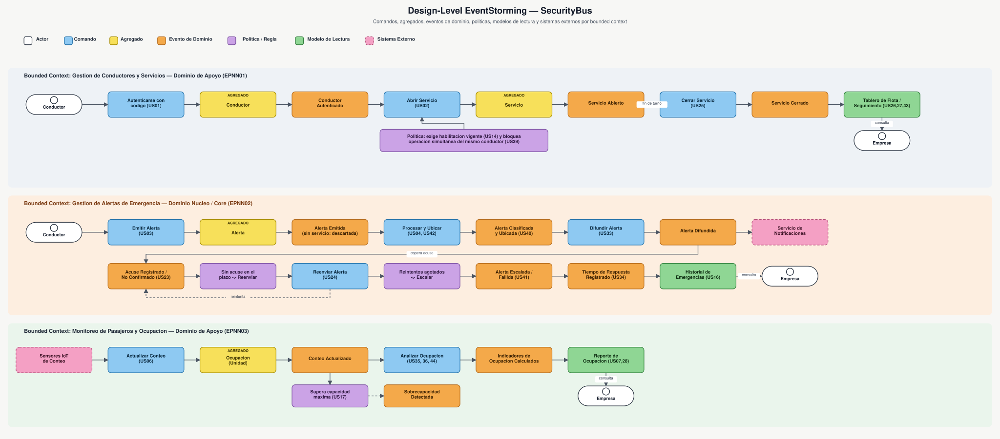
</p>

<p align="center"><em>Figura 4.1. Design-Level EventStorming — Gestión de Conductores y Servicios, Gestión de Alertas de Emergencia (dominio núcleo) y Monitoreo de Ocupación.</em></p>

**Gestión de Conductores y Servicios.** El conductor se autentica con su código vigente (US01) sobre el agregado `Conductor`, lo que produce el evento `Conductor Autenticado`. Antes de aceptar el comando `Abrir Servicio` (US02) sobre el agregado `Servicio`, una política verifica que la habilitación esté vigente (US14) y bloquea cualquier intento de operación simultánea del mismo conductor en otra unidad (US39). El servicio permanece abierto hasta que el conductor emite `Cerrar Servicio` (US25); ambos estados alimentan el modelo de lectura *Tablero de Flota / Seguimiento* que consulta la empresa (US26, US27, US43, US51, US52).

**Gestión de Alertas de Emergencia (dominio núcleo).** El conductor emite la alerta (US03) sobre el agregado `Alerta`; si no existe un servicio en curso, la alerta se descarta en el mismo paso. Una vez emitida, el sistema la procesa, le asocia la ubicación (US04, US42) y la clasifica por gravedad (US40) antes de difundirla a los destinatarios configurados (US33), lo que involucra al sistema externo de notificaciones. La central debe acusar recepción (US23); dos políticas gobiernan lo que ocurre si no lo hace: una reenvía la alerta cuando se vence el plazo (US24) y otra la escala cuando los reintentos se agotan (US41). El tiempo de respuesta se mide (US34) y todo el recorrido queda disponible en el *Historial de Emergencias* que consulta la empresa (US16).

**Monitoreo de Pasajeros y Ocupación.** Los sensores IoT reportan el ingreso y salida de pasajeros, lo que actualiza el conteo del agregado `Ocupación` (US06, US53). Una política evalúa si se superó la capacidad máxima configurada y, de ser así, dispara el evento `Sobrecapacidad Detectada` (US17). En paralelo, el sistema analiza la ocupación para calcular promedios, detectar variaciones anómalas y comparar unidades (US35, US36, US44, US54), publicando los resultados en el *Reporte de Ocupación* que consulta la empresa (US07, US28).

#### 4.6.2. Software Architecture Context Diagram

Siguiendo el modelo C4, el diagrama de contexto (Nivel 1) sitúa a la Plataforma SecurityBus frente a las personas que la usan y los sistemas externos de los que depende, sin exponer aún su estructura interna:

<p align="center">
  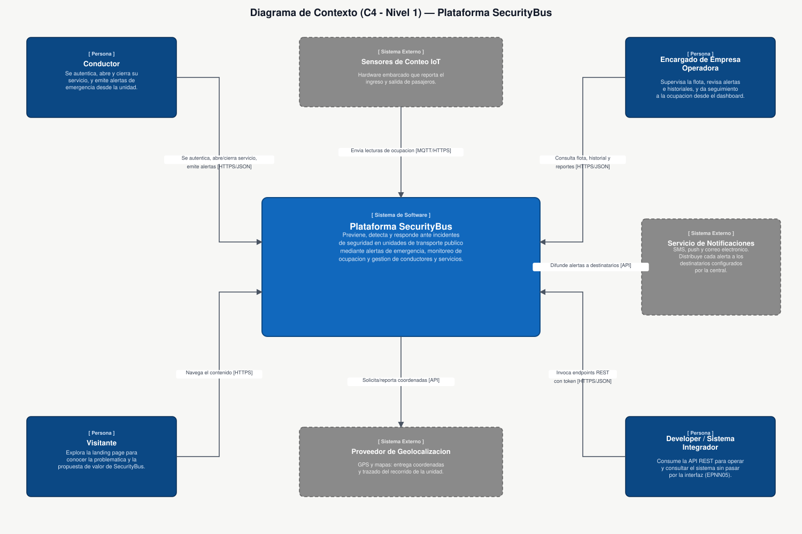
</p>

<p align="center"><em>Figura 4.2. Diagrama de Contexto (C4 — Nivel 1) de la Plataforma SecurityBus.</em></p>

Cuatro tipos de usuario interactúan con la plataforma: el **conductor**, que se autentica, abre y cierra su servicio y emite alertas desde la unidad; el **encargado de la empresa operadora**, que supervisa la flota y revisa alertas e historiales; el **visitante**, que explora la landing page para evaluar la propuesta de valor; y el **developer o sistema integrador**, que consume la API REST sin pasar por ninguna interfaz gráfica (EPNN05). La plataforma, a su vez, depende de tres sistemas externos: los **sensores de conteo IoT** embarcados en cada unidad, un **servicio de notificaciones** (SMS, push y correo) que distribuye las alertas a los destinatarios configurados, y un **proveedor de geolocalización** que entrega las coordenadas y el trazado del recorrido de cada unidad.

#### 4.6.3. Software Architecture Container Diagrams

El diagrama de contenedores (Nivel 2) descompone la Plataforma SecurityBus en sus unidades desplegables. Un API Gateway centraliza la autenticación y autorización de toda petición (TS07, TS13) y enruta el tráfico hacia cuatro microservicios, cada uno alineado a uno de los *bounded contexts* de la sección 4.6:

<p align="center">
  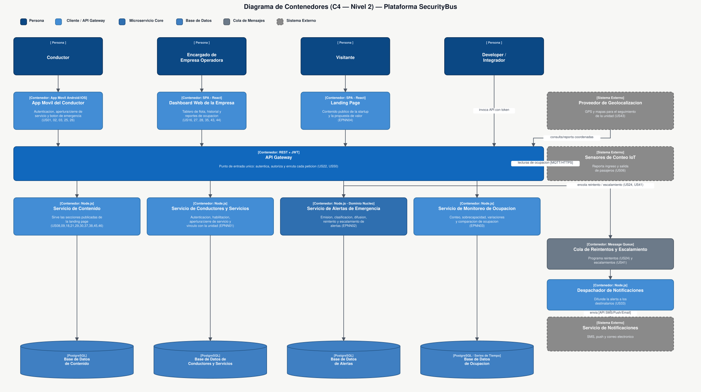
</p>

<p align="center"><em>Figura 4.3. Diagrama de Contenedores (C4 — Nivel 2) de la Plataforma SecurityBus.</em></p>

Los tres clientes (la app móvil del conductor, el dashboard web de la empresa y la landing page) y el developer externo acceden siempre a través del API Gateway, nunca directamente a un microservicio. El **Servicio de Alertas de Emergencia**, alineado al dominio núcleo, se distingue de los demás por delegar sus reintentos y escalamientos (US24, US41) a una **Cola de Reintentos y Escalamiento**, que a su vez alimenta un **Despachador de Notificaciones** encargado de integrar con el servicio externo de SMS, push y correo. Los servicios de **Conductores y Servicios**, **Monitoreo de Ocupación** y **Contenido** siguen el mismo patrón: cada uno persiste su propio estado en una base de datos dedicada, evitando el acoplamiento entre *bounded contexts* a nivel de datos.

#### 4.6.4. Software Architecture Components Diagrams


<center>
<h4>Components Diagram — Authentication Service</h4>

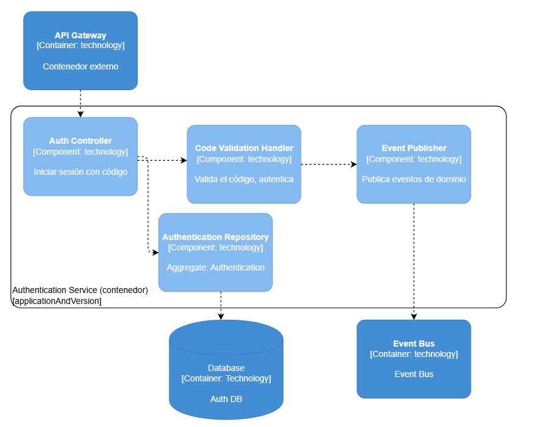

<h4>Components Diagram — User Service</h4>

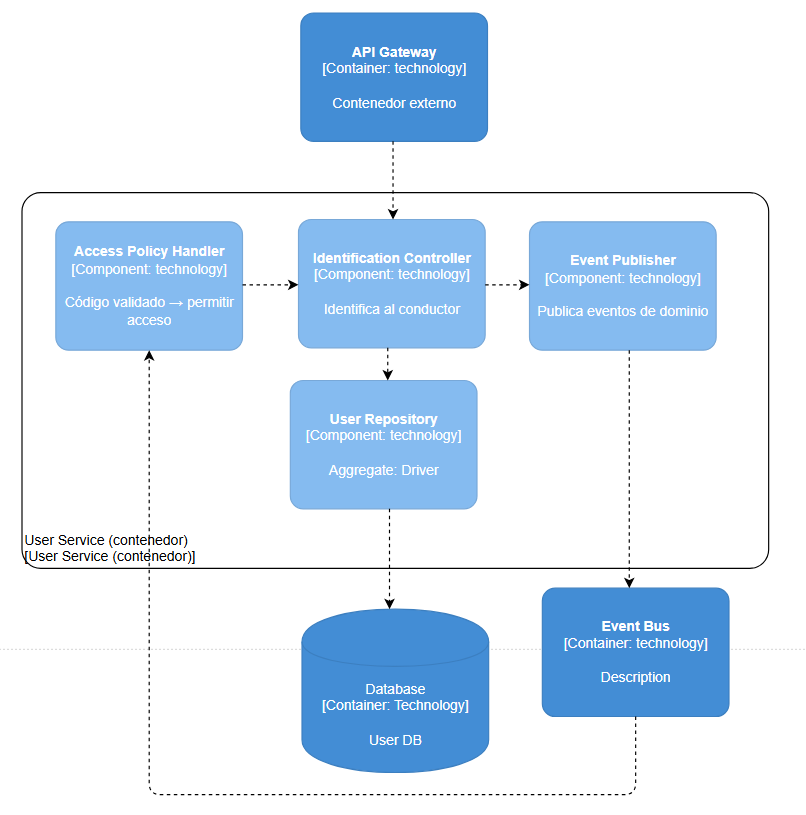

<h4>Components Diagram — Profile Service</h4>

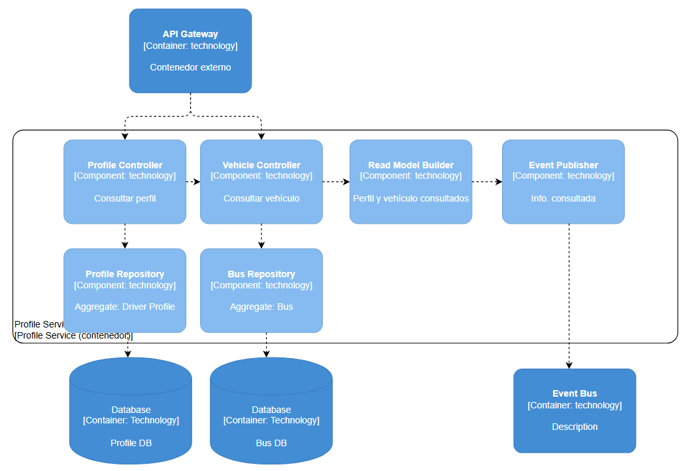

<h4>Components Diagram — Monitoring Service</h4>

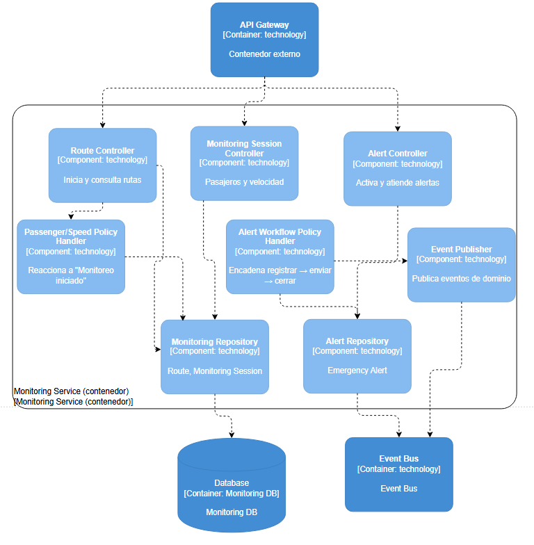

</center>

---


### 4.7. Software Object-Oriented Design
#### 4.7.1 Class Diagrams

La arquitectura del sistema se ha modelado bajo el enfoque de Domain-Driven Design (DDD) para garantizar una alta cohesión y un bajo acoplamiento. Con el objetivo de facilitar el análisis del dominio y asegurar la legibilidad técnica, la representación visual del backend se ha segmentado. A continuación, se presentan los diagramas de clases correspondientes a los 4 Bounded Contexts identificados, detallando sus respectivos Agregados, Entidades y Objetos de Valor (Value Objects).

<center>
<h4>Bounded Context: Authentication Management</h4>

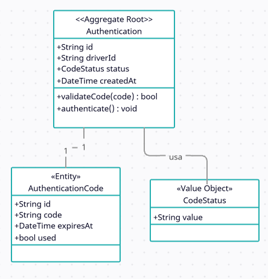

<h4>Bounded Context: User</h4>

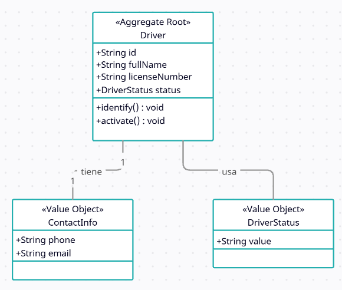

<h4>Bounded Context: Profile</h4>

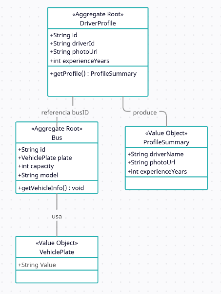

<h4>Bounded Context: Monitoring</h4>

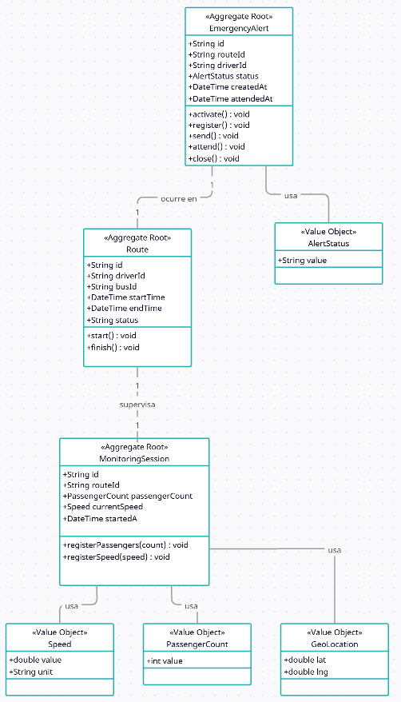

</center>

### 4.8. Database Design

Se adopta una estrategia de persistencia poliglota, con una base de datos independiente por Bounded Context (*database-per-service*), siguiendo el mismo límite que los Aggregates definidos en la sección 4.9. Authentication, User y Profile manejan datos estructurados de bajo volumen de escritura y se modelan como bases de datos **relacionales** (PostgreSQL). Monitoring recibe escritura de alta frecuencia (velocidad, pasajeros, ubicación) y necesita un esquema flexible para el historial de ubicación, por lo que se modela como base de datos **no relacional** orientada a documentos (MongoDB).


#### 4.8.1. Database Diagrams

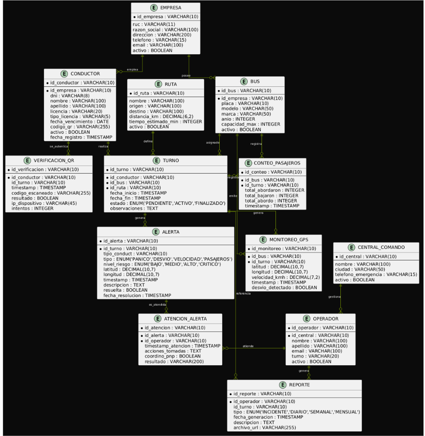

LINK:
[https://www.plantuml.com/plantuml/uml/hLVXRjks4_-kfn3w_v3-XxfekcPT1moeOYkP2bloP3aOEWp2MJmxN2HIeoXtJTkds2FjnKP9L4qJYeesKJw4lj_TaR_Z7OzyNKaGiYvonpbnVxx7fyodKNWHNAvZRnhy-q_eNlgX7tlp-_fr92zToTqDbv8NBg42CqavSvpgXh8I11Jk1hARdU0r8rEUS-7-xzbvysTev9IXV5-YouMyvgOjCadbU_U3uwhlt7PqqNuTnWL1qK_GVgtyWZCvB5tHMtHFJvrFvdoU4FoTrd_flVAKlWKQ3lNqjaBl-vNfcE0MwbmsO0W5AbKAkQd0EC4AI_VxCqCeWDqqmXTdpWEaW1ycmSoR-QjxxxhUbaV-OXdxA--H2vMhntglldCfIR4e1LRW_kHUUV7q5oz-VFhi_oqycRJ_H9sPu6a72hZbBAruHY4_ijN6RPPbb3C3VDw34dFSSiPDmxCEmWBee4F89Dqt5kTHDFUzKEN4WQCgdDbwcaHno_BpBvDdnXcfCyd57Ko_70_2g27ziHCoNcm43Ywun3odX0zXESsGPHJCuFIneILF1t0Tdorcrv3k6xIWYdxZVkObVWjcdD0TJ_yIfj-pi-406ku4xcWbHGCcmS9V9TvYUHJVU9rq2TGCpAYAMjwHEkF1uOBka0qc3bQICZu8gKL24vRqfcXe-zDWuSqV__3aUHywB5Jm6WS549uMj9aX21F_qe-_d4JdwrNBKVqtAMxgwfjJfimX6v8Nd63EpTtj0H0P3CY1KMvnoQ24Z18WQG5_VmtFP1s7KSkq7PbSPIqO7sKxKaZZ0Hj95vs5bD6C7kMW0Mufin4NAmbjVVdXUl7uPEc7iy1NKJXvSk9Da-0gKeEB8FJcmLjl5ftepDjKAFRG74rODIxztvAZy5pvSN0HJ5KFZiBqr-v4iMHcoFOew9PchSDxH6ua-98M3TEYj0FGrpjM6J04meVANc1LvnA8NVcqJ0cjIbvHbIgcvGjjI9b49dbbf9OP9c_kn_fGw8PcK2178M4y72DyIzx7QXWszjmBWscppwfZNWNDuCgVHzEcXQhnqbjvR_muMkczPtIFUIeeLhk3YtFlJMEty6UjlJTFcd_JE4YKPssOWo9TayEXerRpvAN6EDiDWwDxHx3A12tRjD5Ps6yNvXBkEAShdjUDYUdExeI97wKzy-v4iuLMNvGuNlCZ9JsoYrn2diA62mA2MmUnHZVmfuLPbjo21i9fyLz4OQ0wls9xkUp87qbCvWLdL7BnyEJlaIygFtbtgDyKruR6IztZnXDgJtbAK69crVjHA_UNKPpuRMZq-AYXOyc5n2-4X9SeW7pLGMPNRX2gAjMdzIpmuhRuLlx2K-TrMuxXQgr6PeFO8KC1TlgFLHE8x9hkULgBt3uRZuf6hIFsvkaqKjFFkjveoOvAHja9oB_btfFHcW2n6xnn9KwnGB6pBt_wTZpUrwEb7tipVGVkVnZhjdRDMlWulM-_x8vSwNMUs5VWSPPUueTj6pORa2cpEf54DjwQHnlMIE2iUZHcid8JikwoaKfU087AJD2CSq4eusd9oWDXgt5RBwXF3_7EZFrvUvlnL-uoRcfnwSqVuD7PFp0_VfnC-8V3IqnnmABC4MmDTTbMMCahHCSvg6kqlQ0gN23az1QSvlbXOmItbA6Z7Da8L7J7WF01nzQ5JYbNc48jcopBm74w5rgvoogbqnr0nw3TMvMQVaw1kQOnDKFFwbPDrAX4SqPBvR0gfo_vNgy_tUrrswZ0BOecTvKF-zJJohthrbSbAMTALuT5gzWrg9PUjJL1A05hRKFQ8AdInGVExMYwdYTUazT-9Q5o5NyeGM26pDtJgeQyG2RngL9OKR5NKeM2omL11iB5t2KKTW8AU7hVTIdxYVhSfQ05gZcsD8TMOgRdvFThIjJSVmYwkvQJzhtTPRsDg9nnFlliYmg4e9lUQoSqB0b_noQ7cXnMq7CEOjQiNJuHLDSuRZEn3LjTYuc9ACU3m66s5UvgHi2zvQnds6eSp7BSoebTsbh9yjsbdSQiqDgrQZ1UWf3eKgOAXdBHolewiBqSbwbpzClMxOlnCD7RXYH1WTbrJrRhs4pwodBwmK6XBYVsDUPEAhhfsvJCgUoYFSnexO2jvpYlaP6woFy3](https://www.plantuml.com/plantuml/uml/hLVXRjks4_-kfn3w_v3-XxfekcPT1moeOYkP2bloP3aOEWp2MJmxN2HIeoXtJTkds2FjnKP9L4qJYeesKJw4lj_TaR_Z7OzyNKaGiYvonpbnVxx7fyodKNWHNAvZRnhy-q_eNlgX7tlp-_fr92zToTqDbv8NBg42CqavSvpgXh8I11Jk1hARdU0r8rEUS-7-xzbvysTev9IXV5-YouMyvgOjCadbU_U3uwhlt7PqqNuTnWL1qK_GVgtyWZCvB5tHMtHFJvrFvdoU4FoTrd_flVAKlWKQ3lNqjaBl-vNfcE0MwbmsO0W5AbKAkQd0EC4AI_VxCqCeWDqqmXTdpWEaW1ycmSoR-QjxxxhUbaV-OXdxA--H2vMhntglldCfIR4e1LRW_kHUUV7q5oz-VFhi_oqycRJ_H9sPu6a72hZbBAruHY4_ijN6RPPbb3C3VDw34dFSSiPDmxCEmWBee4F89Dqt5kTHDFUzKEN4WQCgdDbwcaHno_BpBvDdnXcfCyd57Ko_70_2g27ziHCoNcm43Ywun3odX0zXESsGPHJCuFIneILF1t0Tdorcrv3k6xIWYdxZVkObVWjcdD0TJ_yIfj-pi-406ku4xcWbHGCcmS9V9TvYUHJVU9rq2TGCpAYAMjwHEkF1uOBka0qc3bQICZu8gKL24vRqfcXe-zDWuSqV__3aUHywB5Jm6WS549uMj9aX21F_qe-_d4JdwrNBKVqtAMxgwfjJfimX6v8Nd63EpTtj0H0P3CY1KMvnoQ24Z18WQG5_VmtFP1s7KSkq7PbSPIqO7sKxKaZZ0Hj95vs5bD6C7kMW0Mufin4NAmbjVVdXUl7uPEc7iy1NKJXvSk9Da-0gKeEB8FJcmLjl5ftepDjKAFRG74rODIxztvAZy5pvSN0HJ5KFZiBqr-v4iMHcoFOew9PchSDxH6ua-98M3TEYj0FGrpjM6J04meVANc1LvnA8NVcqJ0cjIbvHbIgcvGjjI9b49dbbf9OP9c_kn_fGw8PcK2178M4y72DyIzx7QXWszjmBWscppwfZNWNDuCgVHzEcXQhnqbjvR_muMkczPtIFUIeeLhk3YtFlJMEty6UjlJTFcd_JE4YKPssOWo9TayEXerRpvAN6EDiDWwDxHx3A12tRjD5Ps6yNvXBkEAShdjUDYUdExeI97wKzy-v4iuLMNvGuNlCZ9JsoYrn2diA62mA2MmUnHZVmfuLPbjo21i9fyLz4OQ0wls9xkUp87qbCvWLdL7BnyEJlaIygFtbtgDyKruR6IztZnXDgJtbAK69crVjHA_UNKPpuRMZq-AYXOyc5n2-4X9SeW7pLGMPNRX2gAjMdzIpmuhRuLlx2K-TrMuxXQgr6PeFO8KC1TlgFLHE8x9hkULgBt3uRZuf6hIFsvkaqKjFFkjveoOvAHja9oB_btfFHcW2n6xnn9KwnGB6pBt_wTZpUrwEb7tipVGVkVnZhjdRDMlWulM-_x8vSwNMUs5VWSPPUueTj6pORa2cpEf54DjwQHnlMIE2iUZHcid8JikwoaKfU087AJD2CSq4eusd9oWDXgt5RBwXF3_7EZFrvUvlnL-uoRcfnwSqVuD7PFp0_VfnC-8V3IqnnmABC4MmDTTbMMCahHCSvg6kqlQ0gN23az1QSvlbXOmItbA6Z7Da8L7J7WF01nzQ5JYbNc48jcopBm74w5rgvoogbqnr0nw3TMvMQVaw1kQOnDKFFwbPDrAX4SqPBvR0gfo_vNgy_tUrrswZ0BOecTvKF-zJJohthrbSbAMTALuT5gzWrg9PUjJL1A05hRKFQ8AdInGVExMYwdYTUazT-9Q5o5NyeGM26pDtJgeQyG2RngL9OKR5NKeM2omL11iB5t2KKTW8AU7hVTIdxYVhSfQ05gZcsD8TMOgRdvFThIjJSVmYwkvQJzhtTPRsDg9nnFlliYmg4e9lUQoSqB0b_noQ7cXnMq7CEOjQiNJuHLDSuRZEn3LjTYuc9ACU3m66s5UvgHi2zvQnds6eSp7BSoebTsbh9yjsbdSQiqDgrQZ1UWf3eKgOAXdBHolewiBqSbwbpzClMxOlnCD7RXYH1WTbrJrRhs4pwodBwmK6XBYVsDUPEAhhfsvJCgUoYFSnexO2jvpYlaP6woFy3)