## Capítulo V: Product Implementation, Validation & Deployment

### 5.1. Software Configuration Management

#### 5.1.1. Software Development Environment Configuration

Para establecer el entorno de desarrollo del software, se han seleccionado diferentes herramientas, plataformas y guías de trabajo. La siguiente tabla muestra cada recurso utilizado, junto con la finalidad que cumple dentro del proyecto y el medio mediante el cual se puede acceder a este.

| Proceso | Recurso o plataforma | Finalidad | Medio de acceso o Enlace |
|---------|----------------------|-----------|--------------------------|
|Especificación de requisitos|Convenciones Gherkin|Definir condiciones de aceptación y criterios funcionales de manera clara y precisa| [Guía Gherkin](https://cucumber.io/docs/gherkin/)
|Desarrollo Landing Page| Visual Studio Code | Desarrollar, modificar y optimizar el código fuente de la aplicación web|[Visual Studio Code](https://code.visualstudio.com/)|
|Administrador de versiones| Git | Controlar las modificaciones realizadas y administrar las diferentes versiones del proyecto|[Git](https://git-scm.com/)|
|Diseño de experiencia e interfaz| Figma | Elaborar prototipos y organizar visualmente la interfaz de usuario|[Figma](https://figma.com)|
|Publicación y despliegue| Github Pages | Publicar y alojar la página web para permitir su acceso en línea|[Github Pages](https://pages.github.com/)|
|Planificación y gestión del proyecto| Jira Software | Administrar el Product Backlog, planificar los Sprints y realizar el seguimiento de las actividades mediante una metodología ágil|[Jira](https://www.atlassian.com/es/software/jira)|
|Diagramas| PlantUML | Crear representaciones UML relacionadas con la estructura y funcionamiento del sistema|[PlantUML](https://plantuml.com/)|
|Modelado de procesos| UXPressia | Desarrollar herramientas de análisis UX enfocadas en las necesidades y experiencia del usuario|[UXPressia](https://uxpressia.com/)|

#### 5.1.2. Source Code Management

El control del código fuente se realizará mediante GitHub, utilizado como repositorio central para almacenar el proyecto y facilitar el trabajo colaborativo. Además de permitir que los integrantes trabajen sobre una misma base de código, esta plataforma proporciona un historial de las modificaciones realizadas, lo que permite identificar los cambios efectuados durante el desarrollo y mantener su trazabilidad.

Para organizar el proceso de desarrollo, el equipo ha establecido un flujo de trabajo que combina elementos de Git Flow con prácticas de GitHub Flow. Esta organización busca separar adecuadamente el desarrollo de nuevas funcionalidades, la integración de cambios y la gestión de versiones estables, permitiendo que el proyecto pueda incorporar progresivamente nuevas características sin perder el control sobre el código existente.

La estrategia de ramas definida para el proyecto se distribuye de la siguiente manera:

**main:** mantiene la versión estable del sistema que está preparada para ser desplegada.<br>
**develop:** funciona como rama de integración de los avances antes de incorporarlos a la versión estable.<br>
**feature/:** se emplea para desarrollar funcionalidades nuevas o realizar mejoras específicas.<br>
**hotfix/:** se utiliza para solucionar problemas urgentes encontrados en la versión desplegada.

El desarrollo de una nueva funcionalidad comienza creando una rama independiente a partir de develop. Esta forma de trabajo permite que cada modificación sea desarrollada de manera aislada, reduciendo la posibilidad de afectar otras partes del proyecto mientras se encuentra en proceso de implementación.

Una vez que la funcionalidad o corrección ha sido completada, el resultado se incorpora mediante un Pull Request. Antes de realizar la fusión, los demás integrantes pueden revisar los cambios efectuados. De esta manera, la integración no depende únicamente del desarrollador que realizó la modificación, sino que también incorpora una instancia de revisión colaborativa.

**Convención para los commits**

Como complemento al manejo de ramas, se utilizará Conventional Commits para mantener una estructura uniforme en los mensajes de confirmación. Esto permite reconocer rápidamente qué tipo de modificación se realizó y facilita la consulta posterior del historial del proyecto.

Los prefijos considerados son:

| Prefijo | Uso |
|---------|-----|
| **feat** | Incorporación de una nueva funcionalidad. |
| **fix** | Corrección de un error existente. |
| **docs** | Actualización o modificación de documentación. |
| **refactor** | Reorganización o mejora interna del código sin modificar su funcionalidad. |
| **style** | Cambios relacionados con el formato o estilo del código. |
| **test** | Creación o modificación de pruebas. |

**Esquema de versionado**

El proyecto también empleará Semantic Versioning, representado mediante el formato MAJOR.MINOR.PATCH. Este mecanismo permitirá identificar de forma ordenada la evolución de las versiones y diferenciar los cambios realizados según su impacto sobre el sistema.

En conjunto, el uso de GitHub, la estrategia de ramas, los Pull Requests, Conventional Commits y Semantic Versioning proporciona una estructura de trabajo que facilita el control de las modificaciones y la colaboración entre los integrantes. Asimismo, estas prácticas contribuyen a que el código pueda mantenerse y ampliarse de forma organizada durante las siguientes iteraciones del proyecto.

#### 5.1.3. Source Code Style Guide & Conventions
Para evitar diferencias innecesarias en la forma de desarrollar los distintos componentes del sistema, se establecen criterios comunes de programación. Estas reglas serán aplicadas a los lenguajes empleados en el proyecto: HTML, CSS, JavaScript y C#.

Una de las reglas generales consiste en utilizar el inglés para nombrar variables, clases, archivos, comentarios técnicos y elementos de la documentación interna. Con ello se busca mantener una nomenclatura uniforme y facilitar la comprensión del código independientemente del integrante que lo revise o modifique.

Las convenciones adoptadas toman como referencia buenas prácticas provenientes de Google Style Guides, MDN JavaScript, MDN JavaScript Guidelines y Microsoft C# Coding Conventions. También se consideran criterios relacionados con la accesibilidad y la legibilidad del código.

**HTML**

La construcción de la interfaz se realizará mediante HTML5 semántico, buscando que los elementos del documento tengan una organización lógica y que el contenido sea accesible.

Para ello, se tendrán en cuenta las siguientes reglas:

+ Las secciones principales utilizarán etiquetas semánticas como &lt;header&gt;, &lt;nav&gt;, &lt;main&gt;, &lt;section&gt;, &lt;article&gt; y &lt;footer&gt;.
+ Las etiquetas y atributos HTML se escribirán en minúsculas.
+ Todas las etiquetas deberán cerrarse correctamente.
+ Las imágenes incluirán el atributo alt para proporcionar información alternativa y favorecer la accesibilidad.
+ Cuando corresponda, las imágenes definirán sus dimensiones mediante width y height.
+ El documento HTML establecerá lang="en" en la etiqueta &lt;html&gt;.
+ Se incluirán elementos básicos de metadatos, entre ellos &lt;title&gt; y &lt;meta name="descripcion"&gt;.
+ Se evitará incorporar estilos y scripts directamente dentro del HTML cuando no sea necesario.

Ejemplo:
```HTML
<section class="hero-banner">
    
</section>
```

**CSS**

Los estilos estarán organizados de manera modular, procurando que puedan reutilizarse y mantenerse con facilidad. Para la nomenclatura de las clases se utilizará kebab-case y se aplicará la metodología BEM (Block Element Modifier) para establecer una estructura coherente.

También se seguirán estos criterios:

+ Utilizar nombres de clases descriptivos.
+ Organizar las propiedades CSS siguiendo una secuencia lógica relacionada con el layout, box model, tipografía y apariencia visual.
+ Priorizar unidades relativas como rem, %, vh y vw.
+ No especificar unidades cuando el valor establecido sea cero.
+ Diseñar bajo un enfoque mobile-first para facilitar la adaptación a diferentes tamaños de pantalla.
+ Centralizar las variables reutilizables dentro de :root.

Ejemplo: 

```CSS
:root{ 
--primary-color: #2563eb; 
--secondary-color: #64748b; 
} 
.main-header{ 
    padding: 1rem; 
    background-color: var(--primary-color); 
}
```

**JavaScript**

En el caso de JavaScript, las convenciones estarán orientadas a mantener una estructura clara y facilitar la reutilización y modificación del código.

Se aplicarán las siguientes reglas:

+ Las variables y funciones utilizarán camelCase.
+ Las clases y constructores utilizarán PascalCase.
+ Para declarar variables se emplearán const y let, evitando var.
+ Las funcionalidades se distribuirán en archivos independientes de acuerdo con su responsabilidad.
+ Los eventos se gestionarán mediante addEventListener() en lugar de utilizar eventos directamente en el HTML.
+ Los comentarios se reservarán principalmente para explicar fragmentos cuya lógica sea compleja o poco evidente.
+ Los nombres de las funciones deberán describir la acción que realizan.

Ejemplo:

```JavaScript
const submitButton = document.querySelector("#submit-button"); 
function validateForm(){ 
    return true; 
}
```

**C#**

Para los componentes relacionados con el backend y la lógica de negocio se seguirán las convenciones recomendadas para C# por Microsoft.

Entre los principales criterios se encuentran:

+ Aplicar PascalCase a clases, métodos y propiedades.
+ Utilizar camelCase para variables locales y parámetros.
+ Nombrar los métodos mediante expresiones descriptivas que representen acciones.
+ Considerar el principio Single Responsibility Principle (SRP) para distribuir adecuadamente las responsabilidades.
+ Evitar líneas excesivamente extensas para facilitar la lectura.
+ Incorporar comentarios breves en métodos críticos cuando sea necesario.
+ Organizar los componentes utilizando las capas controllers, services, repositories y models.

Ejemplo:
```C#
public class UserService { 
    public bool ValidateCredentials(string userEmail, string password) { 
        return true; 
        } 
    }
```

**Gherkin**

Para expresar los criterios de aceptación y estructurar las pruebas funcionales se empleará Gherkin. Su utilización permitirá describir el comportamiento esperado del sistema mediante una estructura comprensible tanto para los integrantes técnicos como para los stakeholders.

Los escenarios deberán cumplir con las siguientes condiciones:

Seguir la estructura Given-When-Then.
Utilizar un lenguaje comprensible para personas sin conocimientos técnicos.
Contar con títulos específicos que permitan identificar fácilmente el escenario.
Emplear Scenario Outline cuando sea necesario representar diferentes casos que mantengan una estructura similar.

Ejemplo:

```gherkin
Feature: User Login 
Scenario: Sucessful login 
    Given the user is on the login page 
    When the user enters valid credential 
    Then the system should redirect to the dashboard
```

**Principios generales de codificación**

Además de las reglas específicas para cada lenguaje, el desarrollo se orientará mediante cinco principios generales:

+ Readability First: priorizar que el código pueda entenderse fácilmente.
+ Consistency: conservar criterios de desarrollo uniformes en toda la solución.
+ Modularity: separar las responsabilidades en módulos claramente definidos.
+ Scalability: mantener una estructura que pueda soportar el crecimiento futuro del sistema.
+ Maintainability: facilitar la corrección, modificación y evolución del código.

#### 5.1.4. Software Deployment Configuration

**Despliegue de la Landing Page**

La Landing Page será desarrollada utilizando HTML, CSS y JavaScript y posteriormente publicada mediante GitHub Pages. Para ello, primero será necesario mantener correctamente organizados los archivos dentro del repositorio remoto.

**Organización del repositorio**

El archivo index.html deberá encontrarse directamente en la raíz del repositorio, debido a que será utilizado como archivo inicial durante el proceso de publicación. Los recursos complementarios se distribuirán en carpetas independientes según su función, permitiendo diferenciar los estilos, scripts e imágenes y facilitando el mantenimiento posterior.

La estructura prevista será la siguiente:

```
/ 
|---index.html 
|---css/ 
|   |__ styles.css 
|---js/ 
|  |__ main.js 
|---assets/ 
|       |__ images/
```
**Configuración de GitHub Pages**

Una vez que los archivos se encuentren disponibles en el repositorio, se configurará GitHub Pages como servicio de publicación de la Landing Page.

La configuración contempla las siguientes acciones:

1. Acceder al repositorio del proyecto en GitHub.
2. Ingresar a Settings.
3. Seleccionar la sección Pages.
4. Establecer la rama main como fuente de publicación.
5. Seleccionar la carpeta raíz /root como directorio de despliegue.
6. Guardar la configuración.

Después de completar la configuración, GitHub realizará automáticamente el proceso necesario para generar y publicar el sitio.

**Acceso a la versión publicada**

Cuando el despliegue haya finalizado, GitHub proporcionará una dirección pública desde la cual será posible acceder a la Landing Page.

La estructura esperada de la dirección será:

```
https://<usernanme>.github.io/<repository-name>/
```

Esta dirección corresponderá al acceso público de la versión oficial del producto.

**Actualización del sitio**

El proceso de despliegue también contempla las futuras modificaciones realizadas por el equipo. Cada cambio efectuado en la Landing Page deberá registrarse mediante un nuevo commit y enviarse al repositorio.

Cuando los cambios sean incorporados a la rama principal, GitHub Pages actualizará automáticamente el contenido publicado. Así, la versión disponible en línea podrá mantenerse sincronizada con la versión estable más reciente del código fuente.


### 5.2. Landing Page, Services & Applications Implementation

#### 5.2.1. Sprint 1

##### 5.2.1.1. Spring Planning 1
Para este primer Sprint, el equipo estableció como objetivo principal la implementación y despliegue de la primera versión de la Landing Page.

| Campo | Detalle |
|-------|---------|
| Sprint # | Sprint 1 |
| Date | 2026-09-06 |
| Time | 05:00 PM |
| Location | Reunión virtual vía Google Meet |
| Prepared By | Pillaca Gonzales, Andy Saúl |
| Attendees | Justo Yauricasa, Alexander Paolo / Pillaca Gonzales, Andy Saúl /Alvarado Millan, Boris / Martinez Ramos, Bryan Felix / Nawrocki Loureiro, Ian Andre |
| Sprint N-1 Review Summary | Dado que este es el Sprint inicial del proyecto, no se cuenta con un ciclo anterior para revisión. En consecuencia, la implementación del producto comienza formalmente desde sus cimientos. |
| Sprint N-1 Retrospective Summary | Al tratarse de la iteración inicial, no se cuenta con un proceso de retrospectiva previo. No obstante, el equipo estableció el compromiso de asegurar una comunicación fluida y acatar los plazos previstos. |
| Sprint 1 Goal | Nos enfocamos en el desarrollo y lanzamiento de la primera versión de la Landing Page, orientada a comunicar nuestra propuesta de valor: mejorar la seguridad y monitorieo en el transporte público. Consideramos que transmite con claridad los beneficios del sistema a potenciales clientes, lo cual se validará cuando el sitio esté en línea, cuente con todas las secciones clave y permita una navegación fluida. |
| Sprint N Velocity | 09 |
| Sum of Story Points | 09 |

##### 5.2.1.2. Aspect Leaders and Collaborators

| Team Member | GitHub Username | Configuración del Repositorio y CI/CD (L/C) | Estructura Base del Landing Page (L/C) | Funcionalidades Interactivas (L/C) | Corrección de Contenido (L/C) |
|------------|-----------------|---------------------------------------------|----------------------------------------|-----------------------------------|-------------------------------|
| Alvarado Millan, Boris | borisalvaradomillanPE | L | C | C | C |
| Justo Yauricasa, Alexander Paolo | AlexanderrJusto | C | C | C | L |
| Martinez Ramos, Bryan Felix | BryanMR1 | C | L | L | C |
| Pillaca Gonzales, Andy Saúl | apillacag | C | C | C | L |
| Nawrocki Loureiro, Ian Andre | IanNaw | C | C | C | L |

##### 5.2.1.3. Sprint Backlog 1
Se presenta el desglose tecnico de las historias seleccionadas para esta iteracion inicial. El proposito prioritario del Sprint abarca el despliegue de la pagina de aterrizaje y el cimiento de la arquitectura tecnologica del proyecto. Seguidamente, se incluye la imagen del tablero de Trello y la tabla de estados correspondiente a los elementos de trabajo.


link: https://trello.com/invite/b/6aada76451c89821aa1c576d/ATTI9ede0c7d6fa24ae911466aeadaa1cec5C94715BC/sprint-1-astrobusteam 

| Sprint # | Sprint 1 | | | | | | |
|----------|----------|-|-|-|-|-|-|
| **User Story** | | **Work-item / Task** | | | | | |
| Story Id | Story Title | Task Id | Task Title | Task Description | Estimation (Hours) | Assigned To | Status (To-do / In-Process / To-Review / Done) |
| US29 | Segmento al que apunta la solución | T-01 | Segmento al que apunta | Mostramos a como y andonde apunta nuestro sistema. | 2 | Alvarado Millan, Boris | Done |
| US37 | Problemática del transporte en la landing page | T-02 | Problematica | Mostrar la desbentajas del traspodte publico sin nuestro aplicacativo. | 2 | Justo Yauricasa, Alexander Paolo | Done |
| US38 | Propuesta de valor en la landing page | T-03 | Propuesta de valor | Mostrar los valores que tiene nuestra aplicativo en el trasporte publico. | 1 | Martinez Ramos, Bryan Felix | Done |
| US45 | Beneficios del sistema en la landing page | T-04 | Beneficios | Mostrar los beneficios que tiene nuestra aplicativo en el trasporte publico. | 1 | Pillaca Gonzales, Andy Saúl | Done |
| US46 | Equipo detrás de la solución | T-05 | Equipo | Mostramos las soluciones que tene nuestro aplicatico en el traspote publico | 2 | Nawrocki Loureiro, Ian Andre | Done |
| US30 | Mision y vision de la startup | T-06 | Mision y vision | Mostromos la vision y mision en la Landing Page. | 1 | Pillaca Gonzales, Andy Saúl | Done |


##### 5.2.1.4. Development Evidence for Sprint Review

En este primer Sprint el equipo implementó la landing page. Todo el trabajo se desarrolló sobre ramas feature/* que se integraron a develop mediante Pull Requests revisados. A continuación se listan los commits más representativos del sprint.

| Repository | Branch | Commit Id | Commit Message | Commit Message Body | Commited on (Date) |
| :--- | :--- | :--- | :--- | :--- | :--- |
| SecurityBus-730-AW | feature/00-chapter-01 | ce1b67ea7c64e009aa307b91b9498b2e4d3211fd | docs: Merge chapter 1 | Merge branch 'feature/00-chapter-01' of https://github.com/AstroBusTeam/SecurityBus-730-AW into feature/00-chapter-01 | 10/09/2026 |
| SecurityBus-730-AW | feature/10-chapter-02 | e4c0da51c90fd37c8a59aa353c58aa894d881e12 | fix: fix a litle problem in the document | - | 11/09/2026 |
| SecurityBus-730-AW | feature/chapter-3 | 0e8fbc867149f98f4a5e1b9058293ccb81b53b93 | docs: Merge chapter 3 | Merge branch 'feature/chapter-3' into develop| 10/09/2026 |
| SecurityBus-730-AW | feature/chapter-04 | 9063bdf2ee33ae22be820af08c69f8ebb2443b58 | Docs: Create Event Storming | -| 10/09/2026 |
| SecurityBus-730-AW | feature/chapter-05 | 8d75682360fd891997329ce480af8349b238b4a8 | Docs:Event Storming folder created | -| 11/09/2026 |

##### 5.2.1.5. Execution Evidence for Sprint Review

Durante el primer Sprint, la prioridad del equipo fue la implementación y el lanzamiento de la primera versión de la página. El propósito central fue posicionar la propuesta de valor en materia de seguridad para el transporte público mediante una estructura que abarca desde la presentación general y los beneficios, hasta testimonios, funcionalidades clave y canales de contacto. 

La Landing Page incluye las siguientes secciones:

- **Hero:** Sección inicial que presenta el mensaje principal "Protege tu ruta, asegura tu futuro" e incorpora los accesos "Empezar ahora" y "Ver características" para orientar al usuario hacia las principales opciones de la plataforma.


- **Caracteristicas:** Presenta las funciones principales de SecurityBus, como la validación del conductor mediante código QR, el botón de pánico para situaciones de emergencia, el control de pasajeros a bordo y el seguimiento de la unidad durante el recorrido.


- **Funcionalidad** Expone de forma resumida el funcionamiento de SecurityBus, abarcando desde la verificación del conductor hasta las acciones previstas ante una situación de emergencia.


- **Navegacion:** Barra de navegación que facilita el acceso a las distintas secciones disponibles en la Landing Page de SecurityBus.


- **Estadistica:** Muestra datos relevantes que permiten contextualizar los principales problemas relacionados con la seguridad en el transporte público.


- **Interfaz:** Utiliza una apariencia moderna en modo oscuro, acompañada de elementos visuales y tonalidades contrastantes que refuerzan la identidad de SecurityBus.


Link a la Landing Page: [SecurityBus Landing Page](https://astrobusteam.github.io/SecurityBus-landing-page-aw/)

##### 5.2.1.6. Services Documentation Evidence for Sprint Review

En el Sprint 1 de SecurityBus, el desarrollo estuvo centrado únicamente en la construcción de la Landing Page estática. Durante esta etapa no se implementaron servicios web, por lo que aún no se dispone de endpoints que requieran documentación. El desarrollo y la documentación de estos servicios se abordarán en los siguientes Sprints.

##### 5.2.1.7. Software Deployment Evidence for Sprint Review

Las funcionalidades desarrolladas durante este Sprint comprenden tanto la estructura principal de navegación como distintos elementos destinados a mejorar la experiencia del usuario en la Landing Page de SecurityBus. Para su construcción se estableció una organización basada en componentes reutilizables, un sistema de enrutamiento y estilos globales alineados con la identidad visual definida previamente para el proyecto.

El proceso de desarrollo se gestionó mediante Git Flow, utilizando ramas específicas para trabajar las diferentes funcionalidades antes de incorporarlas al proyecto mediante pull requests. Esta metodología permitió mantener una adecuada organización del código y facilitar el trabajo colaborativo entre los integrantes del equipo de AstroBus, quienes participaron en las distintas actividades relacionadas con el desarrollo front-end.

Asimismo, se realizaron ajustes orientados al diseño responsive, buscando que la Landing Page pueda visualizarse correctamente en distintos tamaños de pantalla. También se consideraron aspectos relacionados con el rendimiento y la accesibilidad web, tomando como referencia los estándares WCAG para ofrecer una interfaz más accesible a los diferentes usuarios vinculados con la propuesta de SecurityBus.

- 1: Primera funcionalidad: Implementación de la sección Hero, encargada de presentar el propósito principal de SecurityBus, acompañada de indicadores relacionados con el impacto de la propuesta y botones de llamada a la acción.
- 2: Segunda funcionalidad: Desarrollo de la sección de Características, donde se presentan las seis funcionalidades principales del sistema: Verificación QR, Botón de Pánico, Conteo de Pasajeros, Monitoreo Real, Alertas Inteligentes y Soporte 24/7.
- 3: Tercera funcionalidad: Incorporación de la sección ¿Cómo funciona SecurityBus?, en la que se explica el funcionamiento general de la propuesta mediante cuatro etapas: Inicio de Turno, Monitoreo Constante, Alerta Inmediata e Intervención.

---

### Despliegue en GitHub Pages

1. Se creó el repositorio público en la organización de GitHub del equipo SecurityBus y se subió el código fuente de la landing page construida con React + Vite.
   
2. En el repositorio. Dentro de **Pages**, como origen de publicación, se guardaron los cambios para activar la publicación automática.
   
3. Se configuraron los archivos necesarios para que los assets funcionen correctamente bajo el subdominio de GitHub Pages.
   
4. Se creó el archivo de workflow para automatizar el build y despliegue mediante GitHub Actions cada vez que se realice un push a la rama
   
5. Una vez activado el despliegue, GitHub Pages generó la URL pública del sitio desde donde cualquier usuario puede acceder a la landing page de SecurityBus sin necesidad de credenciales.
    
---

##### 5.2.1.8. Team Collaboration Insights during Sprint

Durante el Sprint 1, los integrantes del equipo AstroBus participaron de manera conjunta en el desarrollo de la Landing Page de SecurityBus, quedando sus aportes registrados mediante los commits realizados en el repositorio del proyecto. Las actividades fueron distribuidas entre los miembros del equipo, permitiendo avanzar de forma organizada en la implementación de las diferentes secciones, funcionalidades, contenido y aspectos visuales de la página.

Para administrar los cambios realizados durante el desarrollo, el equipo utilizó GitFlow como estrategia de control de versiones. El trabajo se realizó principalmente sobre la rama develop, utilizando ramas específicas para cada capitulo. 
Posteriormente, los cambios fueron integrados mediante Pull Requests, permitiendo revisar las modificaciones antes de incorporarlas a las ramas principales del proyecto.


#### 5.2.2. Sprint 2

##### 5.2.2.1. Sprint Planning 2

| Sprint # | Sprint 2 |
| :--- | :--- |
| **Sprint Planning Background** | |
| Date | 27/09/2026 |
| Time | 5:30 PM |
| Location | Virtual |
| Prepared By | Justo Yauricasa, Alexander Paolo |
| Attendees (to planning meeting) | Pillaca Gonzales, Andy Saúl<br>Justo Yauricasa, Alexander Paolo |
| **Sprint 2 Review Summary** | Durante este sprint, el equipo desarrolló la primera versión funcional de la aplicación web de SecurityBus con Vue 3, Vite y TypeScript. El código se organizó bajo una arquitectura DDD, con tres bounded contexts (conductor, tracking y administration) y un núcleo compartido, cada uno con sus capas de dominio, aplicación, infraestructura y presentación. Se implementó el flujo del conductor (verificación con código de empleado, inicio y cierre del servicio, mapa de la unidad, conteo de pasajeros y botón de pánico) y el panel de administración (centro de control con el mapa de la flota y la gestión de alertas, además de las vistas de conductores, unidades, notificaciones, historial de turnos e impacto en números). La aplicación consume una Fake API REST con json-server y conserva la sesión, el turno en curso y las alertas en localStorage, de modo que no se pierden al recargar la página. Además, se dejó configurado su despliegue en Cloudflare. |
| **Sprint 2 Retrospective Summary** | El equipo logró avanzar de forma ordenada gracias a la separación por bounded contexts y capas, que permitió repartir el trabajo sin que unos módulos interfirieran con otros, y al uso de componentes reutilizables, que agilizó la construcción de las vistas. La Fake API permitió desarrollar la interfaz sin depender del backend. Como puntos de mejora, identificamos que para los próximos sprints debemos coordinar mejor la distribución de tareas, acordar desde el inicio el contrato de la API (nombres de recursos y campos), incorporar pruebas automatizadas y reemplazar los comportamientos simulados (escáner QR, movimiento de las unidades y conteo de pasajeros) por datos reales. |
| **Sprint Goal & User Stories** | |
| **Sprint 2 Goal** | Implementar la primera versión funcional de la aplicación web de SecurityBus, cubriendo el flujo del conductor (verificación, servicio y botón de pánico) y el panel de administración (centro de control, conductores, unidades, notificaciones e historial), con una arquitectura DDD, datos servidos por una Fake API y despliegue en Cloudflare, de modo que luego pueda reemplazarse la Fake API por los servicios reales del backend. |
| **Sprint 2 Velocity** | 109 |
| **Sum of Story Points** | 109 |

##### 5.2.2.2. Aspect Leaders and Collaborators

Durante el desarrollo del Sprint 2, se han identificado distintos aspectos funcionales relacionados al diseño y construcción de la aplicación web de SafeBus. Con el objetivo de organizar el trabajo del equipo de manera eficiente, se ha elaborado una matriz de Liderazgo y Colaboración (LACX), donde se asigna a cada integrante el rol de líder (L) en los módulos clave del desarrollo que se le han asignado, y el rol de colaborador (C) en otros aspectos. 

Los aspectos definidos para este Sprint, son:

1. **Apartado de Login:** Registro e inicio de sesión.
2. **Apartado de Dashboard:** Monitoreo de distancia, tiempo, pasajeros, dinero recuadado, ruta y boton de finalizado.
3. **Gestion de flora:** Creacion de conductor y buses. Ademas, de la vinculacion conductor con bus.
4. **Boton de alarma:** Boton que ayuda a mostar el peligro de un conducntor, su ubicacion y estado.
5. **Registros de Alarma:** Visualizacion de reguistos de alarmas y sus estados.
6. **Mapa:** Mostrar las alertas en el mapa.
7. **Sistema de notificaciones:** Envio de alerta a los busces cercanos.


A continuación, se presenta la matriz de responsabilidades del equipo:

| Team Member (Last Name, First Name) | GitHub Username | Login | Configuration of Dashboard | Vegetation management | Alarm button | Alarm Logs | Map | Notification system |
| :--- | :--- | :--- | :--- | :--- | :--- | :--- | :--- | :--- |
| Justo Yauricasa, Alexander Paolo | AlexanderJusto | L | L | L | C | C | C | C |
| Pillaca Gonzales, Andy Saúl | DiazDeveloper | C | C | C | L | L | L | L |

**Nota:** Distribución de responsabilidades de los integrantes del equipo durante el Sprint 2, indicando el liderazgo (L) y la colaboración (C) en cada funcionalidad desarrollada.

##### 5.2.2.3. Sprint Backlog 2

| User Story Id | User Story Title | Work Item/Task Id | Work Item/Task Title | Description | Estimation | Assigned To | Status |
| :--- | :--- | :--- | :--- | :--- | :--- | :--- | :--- |
| US-01 | Autenticación del conductor al iniciar la jornada | T01 | UI Autenticación Conductor | Maquetación e ingreso de código. | 3h | Alexander Justo | To Do |
| US-14 | Verificación de habilitación del conductor | T08 | Lógica Verificación Habilitación | Validación de permisos del conductor. | 3h | Alexander Justo | To Do |
| US-15 | Vínculo entre conductor y unidad | T09 | Registro Asignación Conductor | Asociación del conductor a la unidad. | 3h | Alexander Justo | To Do |
| US-02 | Apertura del registro de servicio | T02 | UI Apertura Servicio | Botón para iniciar el servicio. | 2h | Alexander Justo | To Do |
| US-03 | Envío de alerta desde la unidad | T03 | UI Botón de Alerta | Botón de pánico silencioso. | 3h | Andy Pillaca | To Do |
| US-04 | Notificación de la alerta a la central | T04 | Servicio Recepción Alerta | Envío de alerta a la central. | 4h | Andy Pillaca | To Do |
| US-42 | Ubicación asociada al evento | T20 | Captura GPS en Alerta | Captura de ubicación GPS. | 3h | Andy Pillaca | To Do |
| US-05 | Persistencia del evento de emergencia | T05 | Persistencia de Alertas | Guardado del evento de alerta. | 3h | Andy Pillaca | To Do |
| US-23 | Acuse de recepción de la alerta | T11 | Módulo Acuse de Recibo | Registro de confirmación de alerta. | 3h | Andy Pillaca | To Do |
| US-24 | Reenvío de alertas sin confirmar | T12 | Mecanismo Reintentos Alerta | Reintento de envío no confirmado. | 4h | Andy Pillaca | To Do |
| US-40 | Clasificación de alertas por gravedad | T19 | Priorización de Alertas | Asignación de nivel de prioridad. | 3h | Andy Pillaca | To Do |
| US-33 | Difusión de la alerta a varios destinatarios | T17 | Servicio Multidifusión Alertas | Envío a múltiples destinatarios. | 4h | Andy Pillaca | To Do |
| US-43 | Seguimiento de la unidad asignada | T21 | UI Mapas y Seguimiento GPS | Visualización GPS en mapa. | 5h | Andy Pillaca | To Do |
| US-06 | Conteo automático de ocupantes | T06 | Integración Sensores Pasajeros | Conteo de pasajeros a bordo. | 4h | Alexander Justo | To Do |
| US-07 | Disponibilidad del conteo para reportes | T07 | API Consulta Ocupación | Consulta del número de ocupantes. | 2h | Alexander Justo | To Do |
| US-25 | Cierre del registro de servicio | T13 | UI Cierre Servicio | Botón para finalizar el servicio. | 2h | Alexander Justo | To Do |
| US-26 | Consulta del estado del propio servicio | T14 | UI Estado de Servicio Conductor | Vista del estado actual del viaje. | 3h | Alexander Justo | To Do |
| US-27 | Tablero de estado de la flota | T15 | Dashboard Flota | Panel general de la flota. | 5h | Alexander Justo | To Do |
| US-16 | Revisión del historial de emergencias | T10 | UI Historial Emergencias | Listado de emergencias pasadas. | 4h | Andy Pillaca | To Do |
| US-28 | Seguimiento de la ocupación en operación | T16 | UI Reporte Ocupación Flota | Monitoreo del nivel de carga. | 4h | Alexander Justo | To Do |
| US-35 | Promedio de pasajeros por viaje | T18 | Cálculo Estadístico Ocupación | Cálculo promedio de pasajeros. | 3h | Alexander Justo | To Do |

**Nota:** Relación entre las historias de usuario del Sprint 2 y las tareas planificadas para su implementación, incluyendo su estimación, responsable asignado y estado de ejecución.

##### 5.2.2.4. Development Evidence for Sprint Review

En este segundo Sprint hemos realizado la implementación del fronte-end, donde todo el equipo ha aportado mediante la gestión de ramas. En la siguiente tabla se muestran los commits realizados.

| Repository | Branch | Commit Id | Commit Message | Commit Message Body | Commited on (Date) |
| :--- | :--- | :--- | :--- | :--- | :--- |
| AstroBusTeam-FrontEnd | feature/iam | 2317a3abf7b753f4b52e65aed1632721b0c10258 | feature: add iam | -- | [06/10/2026] |
| AstroBusTeam-FrontEnd | feature/fleet | b4b01276395f339487e1b7b3fdb1e36e9536ef05 | feature: create the fleet component and functions | -- | [06/10/2026] |
| AstroBusTeam-FrontEnd | feature/operations | 830f93a480adb5f957ff975f007e2058a0b2fd88 | Merge pull request #3 from AstroBusTeam/feature/operations | -- | [06/10/2026] |
| AstroBusTeam-FrontEnd | feature/alerts | 5c51e4912c9308f6e14fa750d7a1e1316efe779d | Merge pull request #2 from AstroBusTeam/feature/alerts | -- | [06/10/2026] |
| AstroBusTeam-FrontEnd | feature/shared | 0a53309b6b74c59fb78f26beb44be9cb3cff9339 | Merge pull request #1 from AstroBusTeam/feature/shared | -- | [06/10/2026] |

##### 5.2.2.5. Execution Evidence for Sprint Review

En este Sprint se logró la primera versión funcional de la Web Application de SecurityBus. La aplicación permite que el conductor ingrese con su código de empleado, inicie y cierre su servicio, vea el mapa de su unidad y emita una alerta de emergencia con un solo botón. Del lado de la empresa, permite supervisar la flota desde el centro de control, administrar conductores, vehículos y asignaciones, revisar las alertas y consultar los destinatarios notificados. La interfaz está disponible en español e inglés mediante el selector de idioma del toolbar y se adapta a distintos tamaños de pantalla.

Verificación de identidad del conductor. El conductor ingresa su código de empleado (por ejemplo, SF-90210). El sistema valida que el conductor esté habilitado y tenga una asignación activa, y luego lo redirige al dashboard. Las demás rutas quedan protegidas si no existe una sesión.

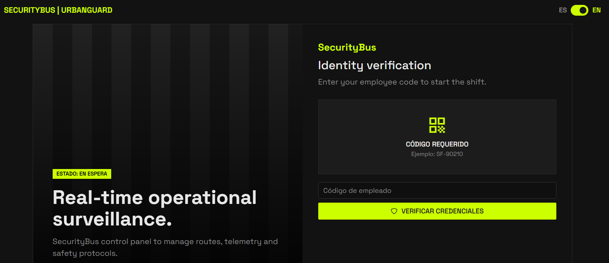

Dashboard e inicio de servicio. Muestra la unidad y la ruta asignadas, permite iniciar el servicio y, al finalizar el turno, presenta el protocolo de cierre y el resumen del turno.

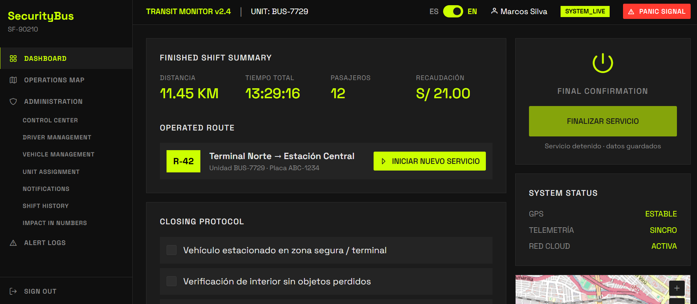

Mapa del servicio y centro de control. El mapa dibuja la posición de las unidades y las alertas activas sobre los tiles de OpenStreetMap. El conductor ve su unidad y la empresa ve toda la flota.

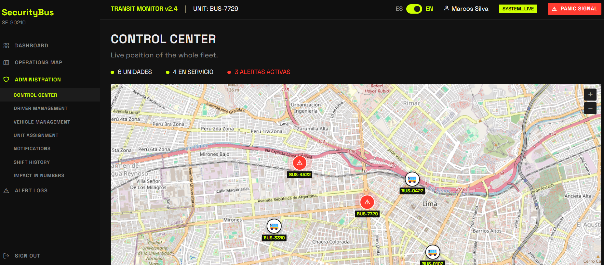

Botón de pánico. Disponible en el toolbar, envía la alerta con la ubicación de la unidad y abre una ventana de 5 segundos para cancelarla.


Registro y detalle de alertas. El registro lista las alertas por fecha y estado y permite reenviar las pendientes. El detalle muestra la línea de tiempo de la alerta, el número de intentos y su confirmación.

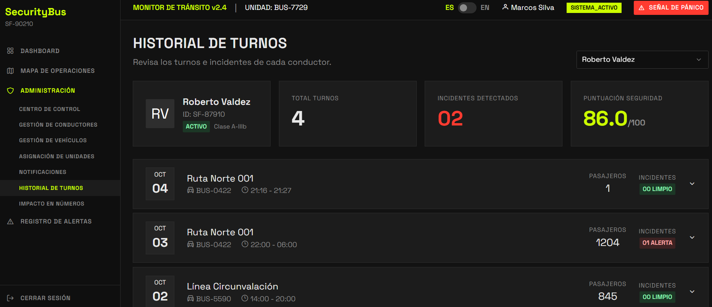

Notificaciones. Presenta los destinatarios activos con su rol y canal, y el registro de entregas con su prioridad y estado.

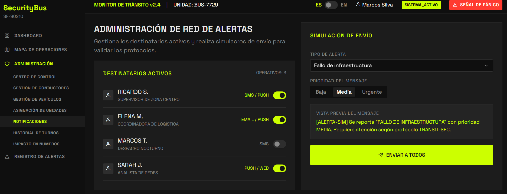

Gestión de conductores, vehículos y asignaciones. Tablas con formularios para crear, editar y eliminar registros, y una vista para asociar conductores con unidades y rutas.

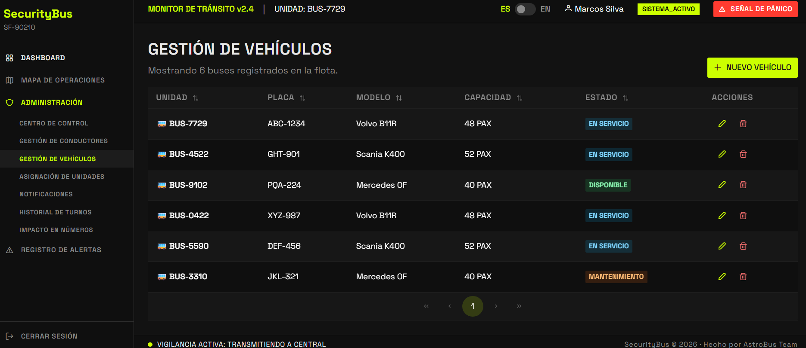

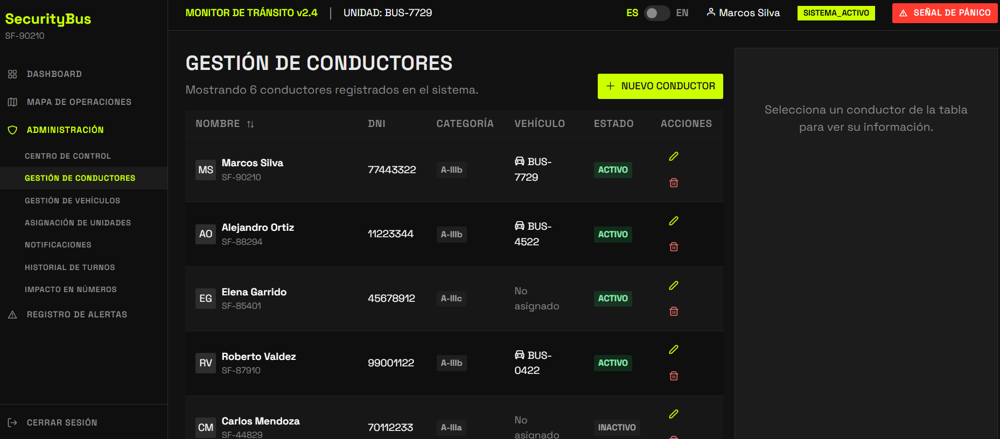

Historial de turnos e impacto en números. El historial lista los turnos con su ruta, distancia, pasajeros e incidentes. La vista de impacto resume indicadores y gráficos de pasajeros y alertas.

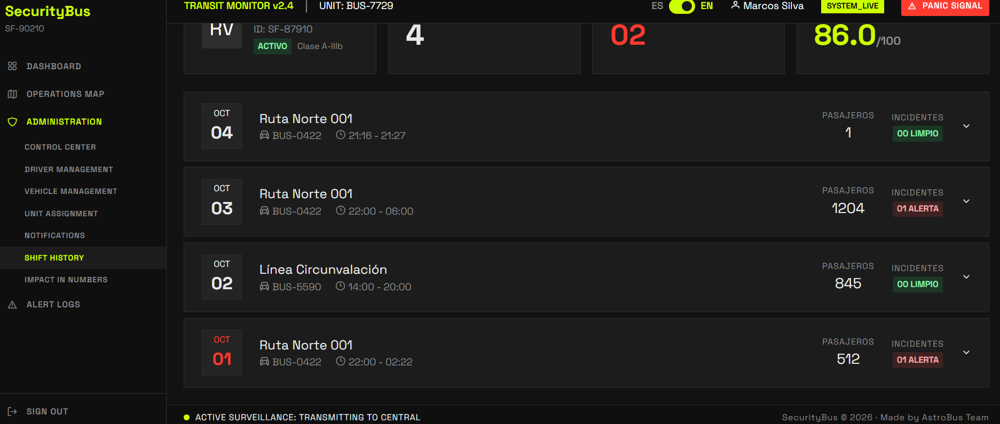

Para evidenciar las funcionalidades implementadas, se adjunta un video donde se muestra la navegación entre las vistas, la interacción con el botón de pánico y la comunicación con la Fake API desplegada.

URL del video de ejecución de la Web Application: [https://upcedupe-my.sharepoint.com/:v:/g/personal/u202418823_upc_edu_pe/IQC9xqrLUfGBTKetm5mY0sOrAQ1vPREJ-m9pPR_8LgcypCI?e=u1aGF4&nav=eyJyZWZlcnJhbEluZm8iOnsicmVmZXJyYWxBcHAiOiJTdHJlYW1XZWJBcHAiLCJyZWZlcnJhbFZpZXciOiJTaGFyZURpYWxvZy1MaW5rIiwicmVmZXJyYWxBcHBQbGF0Zm9ybSI6IldlYiIsInJlZmVycmFsTW9kZSI6InZpZXcifX0%3D](https://upcedupe-my.sharepoint.com/:v:/g/personal/u202418823_upc_edu_pe/IQC9xqrLUfGBTKetm5mY0sOrAQ1vPREJ-m9pPR_8LgcypCI?e=u1aGF4&nav=eyJyZWZlcnJhbEluZm8iOnsicmVmZXJyYWxBcHAiOiJTdHJlYW1XZWJBcHAiLCJyZWZlcnJhbFZpZXciOiJTaGFyZURpYWxvZy1MaW5rIiwicmVmZXJyYWxBcHBQbGF0Zm9ybSI6IldlYiIsInJlZmVycmFsTW9kZSI6InZpZXcifX0%3D)

##### 5.2.2.6. Services Documentation Evidence for Sprint Review

Durante el Sprint 2, el equipo implementó y desplegó una Fake API RESTful con json-server, que simula el comportamiento del backend de SecurityBus mientras se desarrollan los servicios reales. La API expone siete recursos (conductores, vehículos, asignaciones, turnos, alertas, destinatarios y entregas) y soporta operaciones CRUD con los verbos GET, POST, PUT y DELETE. Su configuración de rutas redirige el prefijo /api/v1 a los recursos de la base de datos, de forma que la aplicación consume la misma estructura de URL que tendrá el servicio definitivo. Esto permitió desacoplar la aplicación web de datos locales y realizar pruebas colaborativas sobre una API pública.

URL base del servicio: [https://astro-bus-team-fake-api-aw-730.vercel.app](https://astro-bus-team-fake-api-aw-730.vercel.app)

Dado que json-server no genera documentación OpenAPI automáticamente, en este Sprint los endpoints se documentan en las siguientes tablas. La especificación OpenAPI formal se elaborará con los Web Services definitivos en los siguientes Sprints.

|Endpoint|Acciones implementadas|Descripción|
|--------|----------------------|-----------|
|/drivers|GET,POST,PUT,DELETE|Gestión de conductores|
|/vehicles|GET,POST,PUT,DELETE|Gestión de vehículos de la flota|
|/assigments|GET,POST,DELETE|Asociación entre conductor, vehículo y ruta|
|/shifts|GET,POST,PUT|Registro de turnos de servicio|
|/alerts|GET,POST,PUT,DELETE|Emisión, consulta, actualización y reenvío de alertas|
|/recipients|GET,PUT|Destinatarios de las alertas|
|/deliveries|GET,POST|Registro de entregas de notificaciones|

|Acción|Verbo HTTP|Sintaxis de llamada|Parámetros|Response|
|------|---------|-------------------|------------|-------|
|Listar recursos|GET|/{recurso}|Opcionales: filtros por campo, por ejemplo ?employeeCode=SF-90210 o ?driverId=1&status=active|200 OK con un arreglo JSON.|
|Obtener por id|GET|/{recurso}/{id}|id en la ruta|200 OK con el recurso. 404 si no existe.|
|Crear|POST|/{recurso}|Cuerpo JSON con los campos del recurso|201 Created con el recurso y su id.|
|Actualizar|PUT|/{recurso}/{id}|id en la ruta y cuerpo JSON completo|200 OK con el recurso actualizado.|
|Eliminar|DELETE|/{recurso}/{id}|id en la ruta|	200 OK con un objeto vacío.|

Ejemplo 1. Verificación del conductor por código de empleado (US01 y US14).

```
GET /api/v1/drivers?employeeCode=SF-90210
```

El response es un arreglo con el conductor que coincide, junto con los datos de su licencia y su estado:

```
[
  {
    "id": 1,
    "employeeCode": "SF-90210",
    "firstName": "Marcos",
    "lastName": "Silva",
    "dni": "77443322",
    "category": "A-IIIb",
    "licenseNumber": "Q77443322",
    "licenseExpiry": "2027-05-12",
    "points": 14,
    "rating": 4.9,
    "yearsExperience": 12,
    "status": "active"
  }
]
```

Ejemplo 2. Consulta de la asignación vigente del conductor (US14 y US15).

```
GET /api/v1/assignments?driverId=1&status=active
```

```
[
  {
    "id": 1,
    "driverId": 1,
    "vehicleId": 1,
    "route": "R-42 Terminal Norte - Estación Central",
    "startTime": "05:30",
    "status": "active"
  }
]
```

Ejemplo 3. Emisión de una alerta de pánico con la ubicación de la unidad (US03, US05 y US42).

```
POST /api/v1/alerts
Content-Type: application/json
```

```
{
  "code": "AL-9928",
  "vehicleId": 4,
  "type": "Botón de pánico",
  "receiver": "UNIDAD_MOVIL_04",
  "attempts": 1,
  "status": "pending",
  "createdAt": "2026-10-04T14:22:05",
  "latitude": -12.042,
  "longitude": -77.034
}
```

El response es 201 Created con el mismo objeto y el id generado. Mientras la alerta no sea confirmada, puede reenviarse con PUT /alerts/{id}, que incrementa attempts hasta un máximo de 3.

Se adjuntan las siguientes capturas de la interacción con la API usando los datos de muestra:

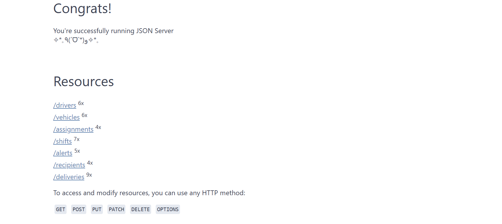

<br>

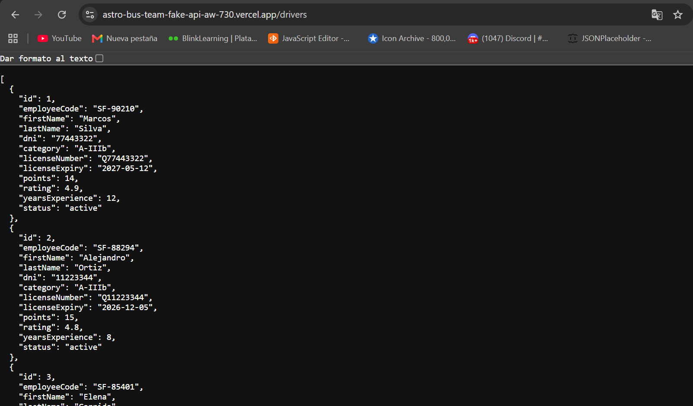


Repositorio de la Fake API: [https://github.com/AstroBusTeam/AstroBusTeam-fake-api-aw-730](https://github.com/AstroBusTeam/AstroBusTeam-fake-api-aw-730)

Commits relacionados con la API en este Sprint:

|Commit Id|Commit Message|Descripción Técnica|
|---------|---------------|------------------|
|f6589ff  |feat: deploy fake-api| Se implementó la configuración inicial necesaria para desplegar la Fake API, preparando el proyecto para ejecutarse en un entorno de producción mediante Vercel.|
|aaaac67  |fix: import express in entrypoint for Vercel detection|Se corrigió el punto de entrada de la aplicación incorporando la importación de Express, permitiendo que Vercel identifique correctamente el servidor y pueda ejecutar la Fake API.|
|894f6b3|fix: import express in entrypoint so Vercel detects the Express app|Se agregó la importación de Express en el archivo de entrada de la aplicación para que Vercel pueda detectar correctamente la aplicación Express durante el despliegue.|


##### 5.2.2.7. Software Deployment Evidence for Sprint Review

Durante el Sprint 2, el equipo realizó el despliegue de la Web Application y de la Fake API. A diferencia del Sprint 1, donde solo se publicó la Landing Page en GitHub Pages, en esta iteración se consolidó una arquitectura de dos servicios: la aplicación web, publicada con Firebase Hosting, y la Fake API, publicada en Vercel. Ambos servicios se configuran mediante variables de entorno, de modo que la URL base de la API y las rutas de cada recurso no quedan escritas en el código.

La arquitectura de despliegue se compone de los siguientes elementos:

Web Application: aplicación Vue 3 compilada con Vite, cuyo resultado (carpeta dist) se publica en Firebase Hosting.
Fake API: servicio RESTful basado en json-server, publicado en Vercel.
Variables de entorno: archivos .env.development y .env.production con la URL base de la API, las rutas de los recursos y el servidor de tiles del mapa.

**Despliegue de la Fake API en Vercel**

- Se creó la cuenta en Vercel y se importó el repositorio de la Fake API desde GitHub.
- Se configuró json-server con el archivo db.json y se definió en routes.json la redirección del prefijo /api/v1/* hacia los  recursos.
- Se publicó el proyecto y Vercel generó la URL pública del servicio.
- Se verificó el funcionamiento consultando los recursos desde el navegador y desde la Web Application.

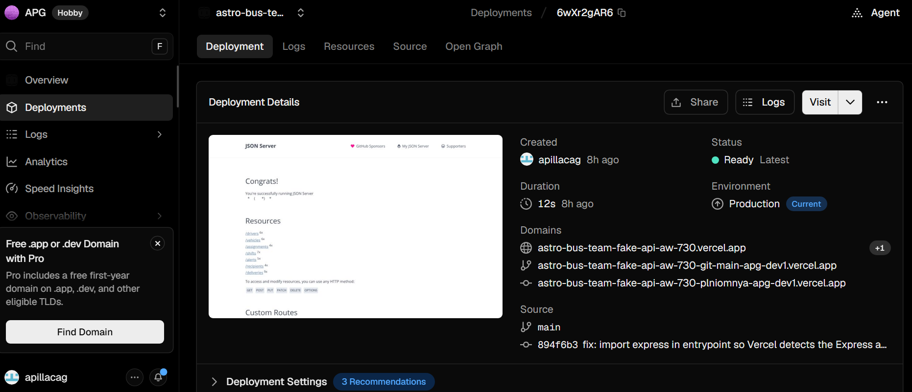

**Despliegue de la Web Application en Firebase Hosting**

- Se creó el proyecto en Firebase y se habilitó Hosting.
- Se configuró firebase.json con la carpeta dist como directorio público y una regla de reescritura de todas las rutas hacia index.html, necesaria para que Vue Router funcione al recargar la página.
- Se definió en .env.production la URL base de la Fake API desplegada.
- Se generó la versión de producción con npm run build y se publicó con Firebase Hosting.
<br>

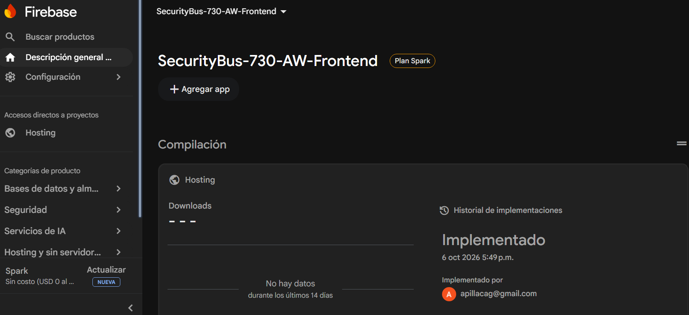

La Web Application desplegada está disponible en: [https://securitybus-730-aw-front-7bf31.web.app/](https://securitybus-730-aw-front-7bf31.web.app/)

Repositorio de la Web Application: [https://github.com/AstroBusTeam/AstroBusTeam-FrontEnd](https://github.com/AstroBusTeam/AstroBusTeam-FrontEnd)


##### 5.2.2.8. Team Collaboration Insights during Sprint

Durante el Sprint 2, el equipo trabajó de forma colaborativa en la implementación de la Web Application y de la Fake API. Se mantuvo la estrategia GitFlow definida en la configuración del proyecto: cada funcionalidad se desarrolló en una rama feature/* creada a partir de develop, y los cambios se integraron mediante Pull Requests revisados por otro integrante antes de incorporarse. Los commits siguieron la convención Conventional Commits, lo que permitió mantener la trazabilidad de cada cambio.

El trabajo se distribuyó según la matriz de líderes y colaboradores de la sección 5.2.2.2. Cada integrante lideró un aspecto del Sprint y colaboró en los demás: IAM & Operations, Fleet Management, Alerts Management, Fake API y Deployment. Esta organización permitió que la interfaz, los datos de prueba y el despliegue avanzaran en paralelo. El seguimiento de las tareas se realizó en el tablero de Trello del Sprint.

A continuación se presentan las evidencias extraídas de los repositorios del proyecto, que reflejan la participación de los integrantes durante el Sprint.

**Evidencia 1: Gráfico de contribuciones por integrante**


**Evidencia 2: Resumen de actividad del Sprint mediante GitHub Pulse**


<br>

**Evidencia 3: Gestión de cambios mediante Pull Requests**


<br>

**Evidencia 4: Organización de ramas bajo GitFlow**


<br>

Las evidencias muestran que todos los integrantes participaron en la implementación, con commits distribuidos durante el Sprint e integraciones frecuentes hacia la rama develop. Entre las actividades colaborativas más relevantes destacan:

- Implementación de las vistas del conductor: verificación de identidad, dashboard, mapa y botón de pánico.
- Desarrollo de los módulos de flota y alertas, con sus tablas, formularios y detalle.
- Configuración de la Fake API y conexión de la aplicación mediante variables de entorno.
- Internacionalización de la interfaz en español e inglés.
- Despliegue de la Web Application y de la Fake API.

Repositorio de la Web Application: [https://github.com/AstroBusTeam/AstroBusTeam-FrontEnd](https://github.com/AstroBusTeam/AstroBusTeam-FrontEnd)

Repositorio de la Fake API: [https://github.com/AstroBusTeam/AstroBusTeam-fake-api-aw-730](https://github.com/AstroBusTeam/AstroBusTeam-fake-api-aw-730)

## Conclusiones

### Conclusiones y Recomendaciones

SecurityBus plantea una solución tecnológica orientada a mejorar la seguridad en el transporte público, considerando las necesidades tanto de las empresas de transporte como de los conductores durante la operación de las unidades.

La propuesta integra funcionalidades como la verificación del conductor mediante código QR, botón de pánico, conteo de pasajeros y monitoreo de las unidades, permitiendo abordar diferentes situaciones relacionadas con el control y la seguridad durante los recorridos.

El proyecto busca facilitar una respuesta más rápida ante situaciones de riesgo y proporcionar a las empresas información que les permita tener un mayor conocimiento de lo que ocurre durante la operación de sus unidades.

Asimismo, SecurityBus busca complementar las medidas tradicionales de seguridad mediante herramientas digitales que permitan mejorar la comunicación y supervisión entre conductores y empresas de transporte.

Primera versión funcional lograda. Con el Sprint 2 la propuesta pasó de la Landing Page a una Web Application que cubre el flujo del conductor (verificación, inicio y cierre de servicio, botón de pánico) y el de la empresa (centro de control, flota, alertas y notificaciones).

Funciones críticas ya demostrables. El botón de pánico envía la alerta con la ubicación de la unidad y ofrece 5 segundos para cancelarla. Esto responde a la recomendación de mantener las acciones de emergencia simples y rápidas.

Arquitectura modular. Organizar el frontend por bounded contexts (iam, operations, fleet y alerts), con capas de dominio, aplicación, infraestructura y presentación, facilita que el trabajo se reparta y que el sistema crezca.

Desacople mediante la Fake API. Consumir una API con la misma estructura de URL que tendrá el servicio real permitió desarrollar la interfaz sin esperar al backend y reducirá el trabajo de integración.

Trabajo colaborativo. GitFlow, Pull Requests y la matriz de líderes y colaboradores permitieron avanzar en paralelo en interfaz, datos de prueba y despliegue.

Despliegue continuo del producto. Ahora hay dos servicios publicados (aplicación en Firebase Hosting, API en Vercel) configurados con variables de entorno.

Experiencia de uso. La interfaz en español e inglés, el tema oscuro y el diseño responsive mantienen la identidad definida en las Style Guidelines.

**Recomendaciones**

Se recomienda priorizar una experiencia de uso sencilla y rápida, especialmente en funcionalidades destinadas a situaciones de emergencia, evitando procesos complejos que puedan dificultar su utilización por parte del conductor.

Es importante continuar validando las necesidades de conductores y empresas de transporte, con el propósito de asegurar que las funcionalidades desarrolladas respondan a situaciones reales presentes durante los recorridos.

También se recomienda garantizar la confiabilidad de funciones críticas como el botón de pánico, la verificación mediante QR y el monitoreo, debido a que su correcto funcionamiento resulta fundamental dentro de la propuesta de seguridad de SecurityBus.

Finalmente, se recomienda desarrollar SecurityBus de manera progresiva, evaluando los resultados obtenidos con los usuarios y utilizando esta información para mejorar las funcionalidades y adaptar la plataforma a las necesidades del transporte público.

Comunicación en tiempo real. Las alertas y la posición de las unidades hoy se consultan de la Fake API. Para que la central reaccione a tiempo, se necesitaría un mecanismo como WebSockets o actualización periódica.

Reemplazar la Fake API por los Web Services reales y documentarlos con OpenAPI, ya que json-server no valida datos ni ofrece seguridad.

Autenticación real. Hoy el ingreso se valida solo con el código de empleado; conviene usar tokens y control de permisos por rol (conductor y empresa).

---

## Bibliografía

Brandolini, A. (2021). Introducing EventStorming: An act of deliberate collective learning. Leanpub. https://leanpub.com/introducing_eventstorming

Brown, S. (2020). The C4 model for visualising software architecture. C4 Model. https://c4model.com/

Cucumber. (s.f.). Gherkin Reference: Syntax and Keywords. https://cucumber.io/docs/gherkin/

EmailJS. (2024). EmailJS Official Documentation. https://www.emailjs.com/docs/

Evans, E. (2003). Domain-Driven Design: Tackling Complexity in the Heart of Software. Addison-Wesley Professional. https://www.oreilly.com/library/view/domain-driven-design-tackling/0321125215/

GitHub. (2024). GitHub Actions and GitHub Pages Documentation. https://docs.github.com/

Gothelf, J., & Seiden, J. (2021). Lean UX: Designing Great Products with Agile Teams (3.ª ed.). O'Reilly Media. https://www.oreilly.com/library/view/lean-ux-3rd/9781492048596/

---

## Anexos

**<center>Anexo A: Guía de entrevistas por segmentos</center>**<br>

Segmento 1: Empresas y organizaciones de transporte publico

|#|Preguntas de Entrevista|
|-|-----------------------|
|1|¿Cómo gestionan actualmente las emergencias que ocurren durante el recorrido de sus unidades?|
|2|¿Cuándo ocurre un asalto, extorsión o incidente, ¿cuál es el procedimiento que siguen para atenderlo?|
|3|¿Qué dificultades encuentran para conocer en tiempo real lo que sucede dentro de una unidad?|
|4|¿Cuáles son los riesgos de seguridad que más afectan a su empresa y a sus conductores?|
|5|¿Cuánto tiempo suele transcurrir entre el incidente y que la empresa sea informada?|
|6|¿Qué herramientas tecnológicas utilizan actualmente para monitorear sus vehículos y conductores?|
|7|¿Considera útil que el conductor pueda activar un botón de pánico con envío automático de ubicación GPS? ¿Por qué?|
|8|¿Qué información sería indispensable que reciba la central al momento de una alerta de emergencia?|
|9|¿Qué factores influirían en la decisión de implementar este sistema en su organización?|
|10|¿Qué beneficios esperaría obtener de una plataforma de seguridad y monitoreo de transporte publico?|

Segmento 2: Conductores de transporte público

|#|Preguntas de Entrevista|
|-|-----------------------|
|1|¿Qué situaciones de inseguridad has vivido o presenciado durante tu jornada laboral?|
|2|¿Qué tipo de apoyo o asistencia esperas recibir por parte de tu empresa después de reportar una emergencia?|
|3|¿En qué momentos del recorrido sientes que existe mayor riesgo de sufrir un asalto o una amenaza?|
|4|¿Cuando ocurre una emergencia, ¿cómo solicitas ayuda actualmente?|
|5|¿Qué tan seguro te sentirías utilizando un botón de pánico que envíe una alerta de forma silenciosa?|
|6|¿Qué tan importante consideras que la empresa conozca tu ubicación en tiempo real durante una emergencia?|
|7|¿Qué dificultades enfrentas para comunicarte con tu empresa mientras estás conduciendo?|
|8|¿Qué información te gustaría que recibiera la central al activar una alerta de emergencia?|
|9|¿Crees que un sistema de seguridad y seguimiento podría ayudarte a reaccionar mejor ante situaciones de riesgo? ¿Por qué?|
|10|¿Qué características considerarías indispensables en una aplicación de seguridad para conductores?|

**<center>Anexo B: Gestión del Product Backlog en Trello</center><br>

**Referencia:** AstroBus. (2026). Product Backlog de SecurityBus. Trello.
<a href="https://trello.com/invite/b/6aada76451c89821aa1c576d/ATTI9ede0c7d6fa24ae911466aeadaa1cec5C94715BC/sprint-1-astrobusteam">https://trello.com/invite/b/6aada76451c89821aa1c576d/ATTI9ede0c7d6fa24ae911466aeadaa1cec5C94715BC/sprint-1-astrobusteam</a>

Se presenta el desglose tecnico de las historias seleccionadas para esta iteracion inicial. El proposito prioritario del Sprint abarca el despliegue de la pagina de aterrizaje y el cimiento de la arquitectura tecnologica del proyecto. Seguidamente, se incluye la imagen del tablero de Trello y la tabla de estados correspondiente a los elementos de trabajo.


**<center>Anexo C: Prototipado y Diseño de Interfaces en Figma</center><br>
**Referencia:** AstroBus. (2026). Design System & Mockups de SecurityBus. Figma.
<a href="https://www.figma.com/design/dZGVlWuEfGy76GBO9a8nmO/SecurityBus?node-id=194-17020&t=qkGb9pUHIXJa9Tu6-0">https://www.figma.com/design/dZGVlWuEfGy76GBO9a8nmO/SecurityBus?node-id=194-17020&t=qkGb9pUHIXJa9Tu6-0</a>

<center>Captura o Evidencia del Diseño de Interfaces - Figma</center><br>


